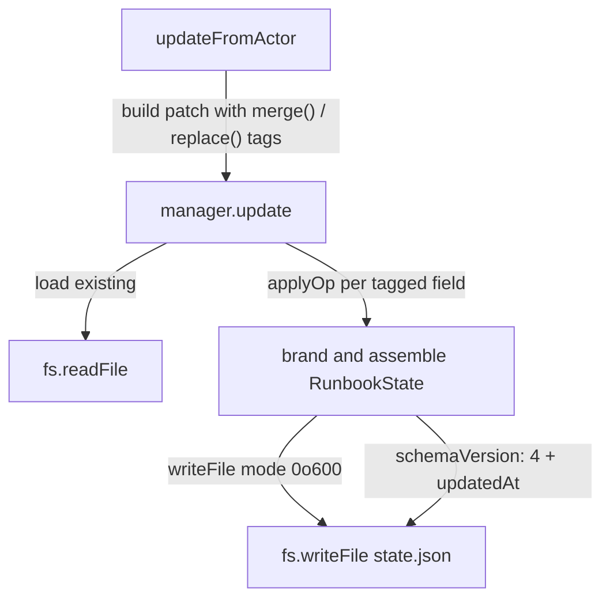
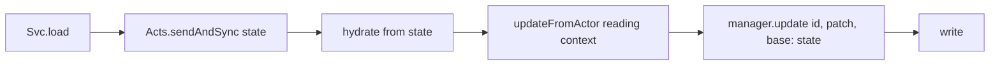
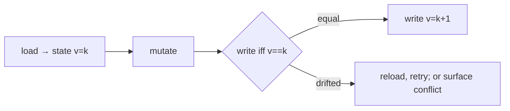
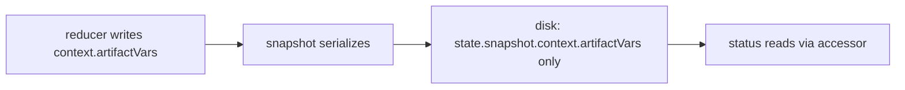
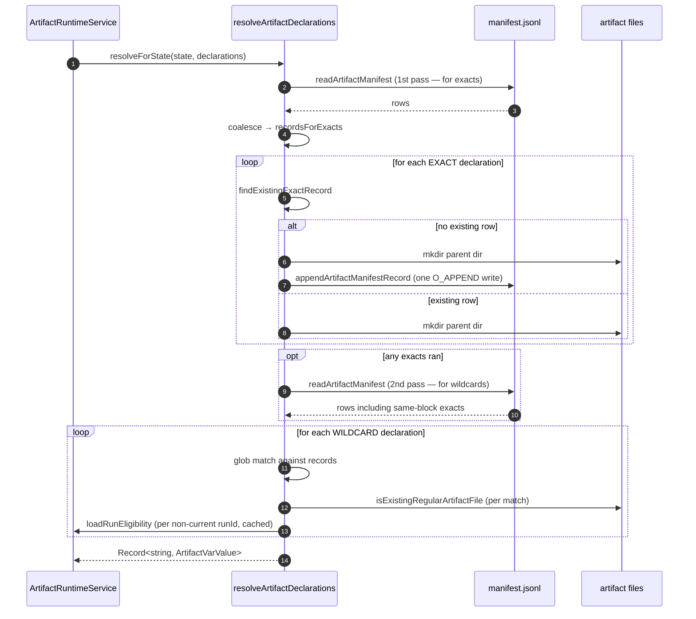

# Artifact Runtime — Save/Load Cycle Walkthrough

Branch: `worktree-phase-4-artifacts-core-runtime`
Schema version: `RunbookState` v4
PR: [#279](https://github.com/tobyhede/rundown/pull/279)

This document walks through the current design for persisting **artifact** state across the save/load cycle, identifies the structural sources of complexity (the threads 3 and 7 review concerns are symptoms, not root causes), and sketches simplification options.

---

## 1. What is an "artifact" in this subsystem?

An **artifact** is a typed reference to a file (or set of files) produced or consumed by a runbook step. The parser reads an `ARTIFACTS` directive on a step and emits `ArtifactDeclaration` nodes; the runtime resolves each declaration into an `ArtifactRecord`:

```ts
// packages/core/src/runbook/artifact-schema.ts
type ArtifactRecord = {
  uri: string;          // e.g. rd://artifacts/<ctx>/runs/<runId>/plan.json
  runId: string;
  contextId: string;
  runbook: { source: 'project' | 'plugin' | 'bundled'; path: string };
  key: string;          // file basename
  timestamp: string;
};

// packages/core/src/runbook/types.ts:246
type ArtifactVarValue = ArtifactRecord | readonly ArtifactRecord[];
```

The runtime tracks **two views** of artifacts:

| Field | Scope | Lifetime | Used for |
|---|---|---|---|
| `artifacts` | Current execution unit only | Replaced on every step entry | Sent in `STEP_ENTERED` payload, surfaced via `rd status` |
| `artifactVars` | Accumulated across the run | Merged across all steps | Template rendering (`{{ artifact PlanPath }}`), CLI status, persisted across resumes |

These two views are the central tension of the design: the same data is held in **two locations on disk** and **two locations in memory**, which gives the mirror logic four edges to keep consistent.

---

## 2. Where artifact state lives

```
.rundown/runs/<runId>.json   ← single file per run
└── RunbookState
    ├── id
    ├── step / substep                  ← cursor (used by service to locate active unit)
    ├── templateVars                    ← seeded inputs (WorkPath, ContextId, …)
    ├── artifactVars  ⚑ TOP-LEVEL       ← accumulated, mirror of context.artifactVars
    ├── artifacts     ⚑ TOP-LEVEL       ← current unit, mirror of context.artifacts
    ├── snapshot                        ← XState's opaque persisted snapshot
    │   └── context: RunbookContext
    │       ├── artifactVars  ⚑ INSIDE-SNAPSHOT
    │       └── artifacts     ⚑ INSIDE-SNAPSHOT
    │
    └── …
```

**The four ⚑ locations hold the same data.** Mirroring is one-way per cycle: `context.*` is the source of truth during a transition; the top-level mirror is rewritten on every `updateFromActor` call.

This duplication is intentional — the snapshot is an opaque XState envelope (`z.unknown().optional()` in the schema, see [`state.ts:185`](../packages/core/src/runbook/state.ts) commentary), so consumers (CLI status, renderer) read from the typed top-level fields, and the machine reads from `context.*`.

---

## 3. The full cycle for one artifact resolution

Triggered once per loop iteration in [`packages/cli/src/services/execution.ts:809`](../packages/cli/src/services/execution.ts) — *before* `mergeEffectiveVars`, template/prompt expansion, and `STEP_ENTERED`:

```mermaid
sequenceDiagram
    autonumber
    participant Loop as CLI run loop
    participant Svc as ArtifactRuntimeService
    participant Acts as RunbookActorService
    participant Mgr as RunbookStateManager
    participant Disk as .rundown/runs/<id>.json
    participant Mach as XState machine + actor

    Loop->>Svc: resolveCurrentUnitArtifacts(id, steps)
    Svc->>Mgr: load(id)
    Mgr->>Disk: read JSON
    Disk-->>Mgr: state v_n
    Mgr-->>Svc: state
    Svc->>Svc: locate active unit; resolve declarations
    Note over Svc: parser ARTIFACTS → ArtifactRecord(s)<br/>mkdir parent dir (no file write)

    Svc->>Acts: sendAndSync(id, steps, ARTIFACTS_RESOLVED{artifacts})
    Acts->>Mgr: load(id)
    Mgr->>Disk: read JSON (same bytes — usually)
    Disk-->>Mgr: state v_n
    Mgr-->>Acts: state
    Acts->>Mach: hydrate snapshot from state.snapshot
    Acts->>Mach: actor.send(ARTIFACTS_RESOLVED)
    Mach->>Mach: reducer: artifacts = replace; artifactVars = merge non-empty

    Acts->>Acts: updateFromActor — read context, build patch
    Acts->>Mgr: update(id, { artifacts: replace, artifactVars: replace, snapshot, ...})
    Mgr->>Disk: read JSON (third load!)
    Disk-->>Mgr: state v_n
    Mgr->>Mgr: apply tagged ops + spread
    Mgr->>Disk: write JSON v_{n+1}
    Mgr-->>Acts: updated state
    Acts-->>Svc: { state, snapshot }
    Svc-->>Loop: { status: 'resolved', state, artifacts }

    Loop->>Loop: mergeEffectiveVars(state)
    Loop->>Loop: emit STEP_ENTERED { artifacts }
```

**Per-resolution cost:**

- **3 disk reads** of the same `state.json` (steps 3, 9, 18).
- **1 disk write** (step 19).
- **1 actor lifecycle**: machine compile → hydrate → start → send → snapshot → stop.
- **No atomicity** between any of the three loads.

---

## 4. Where the merge/replace logic lives

The same conceptual operation is encoded **twice**:

### 4a. XState reducer — [`compiler.ts:2758`](../packages/core/src/runbook/compiler.ts)

```ts
ARTIFACTS_RESOLVED: {
  actions: runbookSetup.assign({
    artifacts: ({ event }) => brandArtifactVars(event.artifacts),   // replace
    artifactVars: ({ context, event }) => {
      const nonEmpty = filter(event.artifacts, ([,v]) => !Array.isArray(v) || v.length > 0);
      if (Object.keys(nonEmpty).length === 0) return context.artifactVars;
      return brandArtifactVars({ ...(context.artifactVars ?? {}), ...nonEmpty });   // merge non-empty
    },
  }),
},
```

### 4b. Mirror patch — [`actor-service.ts:418-429`](../packages/core/src/runbook/actor-service.ts)

```ts
// Comment from the source explaining the asymmetry:
// "The artifact fields are replace-only with `{}` as the meaningful 'no ARTIFACTS'
//  sentinel, so a `undefined` here means 'no mirror this turn' and the
//  persisted value should be preserved."
const artifactVarsPatch =
  snapshot.context && 'artifactVars' in snapshot.context && snapshot.context.artifactVars !== undefined
    ? { artifactVars: replace(snapshot.context.artifactVars) }
    : {};
const artifactsPatch =
  snapshot.context && 'artifacts' in snapshot.context && snapshot.context.artifacts !== undefined
    ? { artifacts: replace(snapshot.context.artifacts) }
    : {};
```

### 4c. Manager merge tags — [`state.ts:368`](../packages/core/src/runbook/state.ts)

```ts
update(id, {
  artifacts: replace(...)        // CurrentArtifactsOp = ReplaceOp
  artifactVars: replace(...)     // ArtifactVarsOp = MergeOp | ReplaceOp
  ...
})
```

The same conceptual rule — *replace `artifacts`, merge non-empty into `artifactVars`* — is split across these three places. The merge happens in (a). The mirror does an unconditional `replace` in (b) because the snapshot's `context.artifactVars` *already* holds the merged result. So the order matters: **the reducer's merge result feeds the mirror's replace.**

This is correct, but it's why the mirror code has a long load-bearing comment — the asymmetry between "undefined means preserve persisted" (artifacts) and "undefined means clear" (activeFrameKey) is not self-evident from the patch shape.

---

## 5. State persistence mechanics

Three layers wrap each disk write:



Key invariants:

- **No migration**: schema bumps reject old state (`StaleRunbookStateError`); user must `rd prune` and restart.
- **Owner-only file mode** (`0o600`) on every write.
- **No locking, no fsync, no atomic rename** — a crash mid-write leaves a torn JSON file. (`writeFile` is *not* atomic on POSIX.)
- **Tagged ops at the manager boundary** (`merge` / `replace` / `MergeOp` / `ReplaceOp` types) make merge-vs-replace intent visible at call sites.
- **Schema version `4`** is bumped on this PR for the new `artifacts` field.

---

## 6. Issues observed in this subsystem

Each issue is annotated with which review thread surfaced it and which design property is the root cause.

### 6a. Race between load(1) and load(3) — thread 7

```
T0:  Process A:  manager.load(id)            → state cursor at step N
T1:  Process A:  resolve declarations for step N
T2:  Process B:  rd goto N+1 — writes state.json with cursor at step N+1
T3:  Process A:  sendAndSync.createActor.load(id) → hydrates step N+1 state
T4:  Process A:  send ARTIFACTS_RESOLVED — applies step N's artifacts to step N+1 context
T5:  Process A:  updateFromActor.update.load(id) → loads step N+1 state again
T6:  Process A:  write step N+1 state with step N's artifacts mirrored
```

**Root cause:** the cycle does three separate loads with no version check or lock. The XState reducer accepts `ARTIFACTS_RESOLVED` regardless of cursor position.

### 6b. Mirror-must-stay-in-sync — thread 3 (and pre-existing)

The reviewer's request to add `manager.load()` round-trip assertions exists because the mirror logic is non-trivial: `updateFromActor` does a conditional patch with sentinel-aware semantics, and a regression that drops the `artifactsPatch` would make the in-memory test pass while persistence quietly fails.

**Root cause:** the same data lives in `context.artifacts` *and* top-level `state.artifacts`, with custom mirror logic between them. Tests must assert both sides because either can drift.

### 6c. Empty-array overwrite — thread 8 (now fixed)

`ArtifactVarValue = ArtifactRecord | readonly ArtifactRecord[]`. A wildcard declaration that matches zero files resolves to `[]`. Without per-key filtering, `[]` would overwrite a previously accumulated non-empty value for the same key.

**Root cause:** the merge contract ("only accumulate non-empty values") was implemented at the record level, not the per-key level.

### 6d. File-vs-directory assertion confusion — thread 4

The resolver only `mkdir`s the parent directory; the artifact body is written by the step's *command* at execution time. The original test asserted parent-dir existence (correct contract); the reviewer's suggested fix to assert the file existed contradicts the actual layer responsibility.

**Root cause:** "artifact resolution" is overloaded. Resolution = reference + parent dir. Materialization = step command writes the bytes. The naming doesn't make this split obvious.

### 6e. Three loads per resolution

Even on the happy path, `resolveCurrentUnitArtifacts` triggers three reads of the same `state.json`. The cycle is:

1. Service loads → reads cursor, resolves declarations.
2. Actor service loads → hydrates the actor.
3. Manager loads → applies update.

**Root cause:** layers built around the actor lifecycle each do their own `manager.load`. There's no "request-scoped state" or "loaded state passed through".

---

## 7. Alternative designs

The numbered options below trade differently against complexity, atomicity, and breaking-change cost.

### Option A — Pass state through, single load per cycle

Add a `RunbookState` parameter to `actorService.sendAndSync` (and `createActor`). The service loads once, passes the same object through to the actor service and the manager update.



**Pros:** removes 2 of 3 loads. Reduces race window. No schema change. Small, surgical refactor.
**Cons:** doesn't solve cross-process races (another shell can still write between the single load and the write). Doesn't change the mirror duplication.
**Effort:** low.

### Option B — Optimistic concurrency via version field

Add `RunbookState.version: number` (or use `updatedAt`). `manager.update` checks the loaded version; on mismatch, throws or returns a conflict result the caller retries.



**Pros:** solves cross-process races at the layer that owns persistence. Useful for delegation/claim/goto in addition to artifacts.
**Cons:** schema bump (v5). Every caller needs a retry loop or explicit conflict handling. Pre-release no-migration policy means existing runs would need pruning.
**Effort:** medium — touches every `manager.update` caller.

### Option C — Drop the mirror; XState snapshot is the only home

Remove top-level `artifacts` and `artifactVars` from `RunbookState`. Consumers (status, renderer) read from `state.snapshot.context.artifacts` via a typed accessor.



**Pros:** eliminates mirror duplication entirely. `updateFromActor`'s artifact patches go away. Tests for "persisted state" become snapshot-shape tests.
**Cons:** the snapshot envelope is `z.unknown()` — adopting it as a typed read source means structural validation. Risk: XState may change snapshot shape between versions; the no-migration policy makes this fragile. Schema bump.
**Effort:** medium-high.

### Option D — Drop XState for artifacts; resolve and write inline

Remove the `ARTIFACTS_RESOLVED` event entirely. The runtime service does:

```ts
const state = await manager.load(id);
const artifacts = await resolveForState(state, declarations);
const merged = mergeNonEmpty(state.artifactVars, artifacts);
await manager.update(id, { artifacts: replace(artifacts), artifactVars: replace(merged) });
```


**Pros:** simplest. One load, one write, one merge function (in one place). No actor lifecycle. Removes thread 3 *and* thread 7 mostly — only one load-write window remains.
**Cons:** abandons the "core owns artifact state in machine" framing of Phase 4. Renderer / status would still need to see artifacts on snapshot rehydrate, so context seeding (`compileMachineFromState` already passes `artifactVars`) needs to keep working — fine, but it makes artifacts a *seed-only* context value, never updated mid-machine. This is actually how `templateVars` is treated today.
**Effort:** medium — undoes some of the recently landed work. But mirrors the established `templateVars` precedent.

### Option E — Cooperative file lock at the manager boundary

Wrap every `manager.update` (and the load-then-write window) with an OS-level file lock (`flock` / `proper-lockfile`). Releases on completion or process exit.

**Pros:** bulletproof against multi-process races without schema changes.
**Cons:** zombie locks on crash (handled by lockfile libraries but adds an attack surface). Performance overhead. Not Windows-portable without care.
**Effort:** medium — needs careful crash handling.

### Option F — Single-writer enforcement via session

Already-implicit in the codebase: `.rundown/session.json` tracks the active runbook. Promote this from "hint" to "enforcement": only the process that holds the session may advance the run. `rd goto` from another shell would either fail-fast or block.

**Pros:** prevents the multi-shell scenarios that motivate threads 3/7 entirely.
**Cons:** changes user-facing semantics. Some workflows (the `rd pass` from a separate terminal use-case) rely on multi-process state mutation. Would need a feature-by-feature audit.
**Effort:** high — UX implication.

### Trade-off summary

| Option | Solves race | Removes mirror | Schema bump | Effort |
|---|---|---|---|---|
| **A** Pass state through | Reduces window | No | No | Low |
| **B** Optimistic version | Yes | No | Yes | Medium |
| **C** Snapshot-only | Reduces window | Yes | Yes | Medium-high |
| **D** Inline resolve | Reduces window | Yes | No | Medium |
| **E** File lock | Yes | No | No | Medium |
| **F** Single writer | Yes (prevents) | No | No | High (UX) |

### A pragmatic combination

**A + D** is the smallest path that addresses both root causes:

- A makes "load once per resolution" cheap.
- D collapses the artifact merge into a single function in one place.
- Together they remove the thread-3 mirror complexity and shrink the thread-7 window from "three loads" to "one load + one write".
- Neither requires a schema bump or breaks the no-migration policy.
- Cross-process races still exist but are reduced to the same window every other `manager.update` already has — at which point Option B or E is a separate, broader fix.

---

## 8. Open questions for the design discussion

1. **Is "core owns artifact state in machine" load-bearing?** Phase 4 framed this as the goal. If the only consumers are the CLI run loop (resolves) and `rd status` (reads from disk), Option D's "treat artifacts like `templateVars` — seeded into context, but updated by the runtime, not the machine" is a smaller surface.

2. **Are concurrent CLI processes a supported scenario?** If yes, threads 3/7 plus delegation/claim races all need a single answer (Option B or E). If no, Option F + minimal in-process discipline is enough.

3. **Should `RunbookState.snapshot` ever be the source of truth for typed reads?** The `z.unknown()` schema choice and the load-bearing comment in `actor-service.ts:166-199` say no. Option C contradicts that choice; either flip it or drop Option C.

4. **What's the contract of "artifact resolution"?** Is it (a) emit references + ensure parent dir exists, or (b) ensure the file exists? The thread-4 confusion suggests this needs to be documented in `docs/spec/` so reviewers don't keep raising the same question.

---

## 9. The artifact manifest — a parallel persistence layer

The walkthrough above tracks `RunbookState` (per-run JSON file), but artifacts also live in a **second on-disk layer**: the **per-context manifest**. This layer is independent of `RunbookState` and has *different* concurrency properties — which both complicates and simplifies parts of the picture.

### 9a. Where the manifest lives

```
<WorkPath>/.rd-<ContextId>/manifest.jsonl   ← one file per context
```

JSON Lines: one [`ArtifactManifestRecord`](../packages/core/src/runbook/artifact-manifest.ts#L14) per line. The record shape is identical to `ArtifactRecord` — `{ uri, runId, contextId, runbook, key, timestamp }`.

A **context** spans many runs (e.g. all runs invoked from the same Claude Code conversation). The manifest is the cross-run catalog of every exact artifact ever resolved in that context. `RunbookState` is per-run and only knows what *this* run owns.

### 9b. How writes work — append-only, atomic per line

[`writeManifestLineSync` (artifact-manifest.ts:315)](../packages/core/src/runbook/artifact-manifest.ts#L315) is the production writer:

```ts
const flags = O_CREAT | O_APPEND | O_WRONLY | noFollowFlag();
const fd = fs.openSync(manifestPath, flags, 0o600);
// ... validate path is contained in workRoot ...
const line = Buffer.from(`${JSON.stringify(record)}\n`, 'utf8');
fs.writeSync(fd, line, 0, line.length);
```

Properties this gives us:

- **Atomic per line**: `O_APPEND` writes ≤ `PIPE_BUF` (4096 bytes on Linux/macOS) are atomic across processes. ArtifactRecord rows are well under that, so concurrent appends from multiple processes interleave cleanly — no torn rows.
- **Append-only**: rows are never rewritten or deleted. Duplicate identity rows are *allowed* on disk and resolved at read time by `coalesceManifestRecords` ("newest timestamp wins; ties → later row in input order").
- **No coordination needed**: there is no manifest lock, no version field, no read-modify-write cycle. Writers don't need to know what other writers are doing.

This is a structurally different choice from `RunbookState`'s full-file rewrite. It's the precedent for *how* the project could persist mutable data without a race window — but it also means the manifest is a separate kind of thing, with its own rules.

### 9c. How reads work — read, coalesce, filter

[`readArtifactManifest` (artifact-manifest.ts:115)](../packages/core/src/runbook/artifact-manifest.ts#L115):

1. Read entire file as text.
2. Split on `\n`, parse each line as JSON.
3. Validate each line against `ArtifactRecordSchema`; reject rows whose `contextId` mismatches the requested context (defence-in-depth).
4. Return ordered records.

[`coalesceManifestRecords`](../packages/core/src/runbook/artifact-manifest.ts#L193) then deduplicates by identity tuple `(contextId, runId, runbook.source, runbook.path, key)`. The "newest timestamp wins" rule means an exact declaration whose record is re-appended later (e.g. on retry) takes precedence on the next read.

### 9d. Where the manifest fits in the resolution flow

Refining the §3 sequence diagram — the resolver does manifest I/O *inside* `resolveForState`, before the `sendAndSync` actor cycle:



Notes:

- **Exacts before wildcards**, regardless of source order — so a wildcard in the same block can match an exact in the same block. Hence the conditional 2nd manifest read.
- **Wildcards check the actual file** via `isExistingRegularArtifactFile`. Exacts don't (the file is the step's job).
- **Eligibility** is "current run, OR completed sibling run in the same context" — wildcards across runs see only frozen evidence.

### 9e. Two layers, different rules

| Property | `RunbookState` (per-run) | Manifest (per-context) |
|---|---|---|
| Scope | One run | All runs in a context |
| Format | Single JSON file | JSON Lines append-only |
| Atomicity | Full-file rewrite, **not atomic** | Per-line `O_APPEND`, **atomic** |
| Schema versioning | `schemaVersion: 4`, no migration | None — schema validated per row |
| Concurrent writers | Race window between load & save | Safe; coalescence at read time |
| Used for | Cursor, lifecycle, accumulated `artifactVars`, current-unit `artifacts`, snapshot | Wildcard discovery; exact-record dedupe across resumes/retries |
| Consumed by | Run loop, `rd status`, renderer | Resolver only (and `findArtifactMatches` for selector URIs) |

The two layers are **redundant for exacts** in one direction: an exact `ARTIFACTS PlanPath = plan.json` produces

- a manifest row in `.rd-<ctx>/manifest.jsonl`, AND
- an entry in `state.artifacts` / `state.artifactVars` (and the snapshot mirrors).

A future run can pick this up via the manifest even if it never sees the original `RunbookState`. The state file is the *fast path* (no scan); the manifest is the *durable record*.

### 9f. How the manifest changes the issue analysis

Revisiting §6 with the manifest in view:

**Thread 4 (file vs. directory) — sharper picture.** Resolution has *three* effects on disk, not two:

1. Append a manifest row (durable; happens for new exact declarations).
2. `mkdir -p` the parent directory of the artifact file.
3. *(Not done by resolution)* — the artifact file itself is written by the step's command.

So the *resolver's* test contract should be "manifest row appended ∧ parent dir exists." The reviewer's "stat the file itself" suggestion conflates resolution with materialization. A fuller test would assert (1) and (2) explicitly — that catches more regressions than either the original parent-dir check or the proposed file check.

**Thread 7 (race window) — manifest is mostly fine, state is the problem.** A concurrent writer of the manifest produces correct results because of `O_APPEND` + `coalesceManifestRecords`. The race that matters is in `RunbookState`: cursor advance between the service's load and the actor service's load. The manifest is not vulnerable to this same pattern.

**However:** wildcards have their own consistency window. The resolver re-reads the manifest after exacts (line 104-107) "so wildcards observe same-block exact rows" — but if a *different process* appends an exact concurrently with our wildcard read, our wildcard sees a moving target. The source comment ("the reread observes external concurrent manifest writes; that timing isn't injectable through the resolver API") flags this as known and acceptable.

**Thread 8 (empty-array overwrite) — interacts with wildcards.** A wildcard that matches zero manifest rows resolves to `[]`. With the fix, `[]` no longer overwrites a previously accumulated non-empty value. Without the manifest layer, `[]` would only happen for *truly empty* sets; with the manifest, it can happen because the manifest hasn't received the matching row *yet* (timing-dependent). The fix is correct either way, but the manifest is the reason the failure mode is reachable in normal operation.

### 9g. How the manifest changes the alternative-design analysis

| Option | Effect on the manifest | Net effect |
|---|---|---|
| **A** Pass state through | None — manifest reads are inside `resolveForState`, untouched | Reduces `state.json` reads from 3→1; manifest reads still 1–2 per resolution. Improvement holds. |
| **B** Optimistic version on `RunbookState` | None — manifest already concurrency-safe | Useful for state, redundant for manifest. |
| **C** Snapshot-only (drop top-level mirror) | None | Removes `state.artifacts`/`artifactVars` mirror but the manifest is still the authoritative cross-run record. Ironically, with C the *manifest* becomes the only durable persistence besides the opaque snapshot — making the snapshot's `z.unknown()` schema choice riskier. |
| **D** Drop XState event; resolve + write inline | None — resolver still reads/writes manifest as today | Smallest change; manifest stays as-is. |
| **E** File lock on `state.json` | Don't lock the manifest — it doesn't need it | Locking only the state file is sufficient; the manifest is already safe. |
| **F** Single-writer session | The manifest still wants to accept appends from delegated children with their own session contexts | F doesn't compose cleanly with cross-run discovery; need to special-case manifest writes. |

**The manifest's existence reinforces the recommendation in §7.** Option D (resolve + write inline) is more attractive than it first looked: the manifest *already* handles the durable cross-run truth via append-only writes, and `RunbookState.artifactVars` is mostly a fast-path cache for the current run's resolution result. Treating it that way (single load + write, no machine roundtrip) doesn't sacrifice durability, because the manifest is already the source of truth.

### 9h. Open question raised by the manifest

**Is `RunbookState.artifactVars` strictly necessary?** Three observations:

1. The manifest is the durable cross-run record for exact declarations.
2. Wildcards re-resolve from the manifest on every step entry.
3. `RunbookState.artifactVars` is rebuilt on every resolution by re-running the same code path.

If (3) is always true, `state.artifactVars` is a memoization of the latest resolution — derivable from the manifest + current run cursor. Removing it would:

- Force `rd status` to do a manifest scan when reporting artifacts (cheap; small JSONL files).
- Force the renderer's `{{ artifact PlanPath }}` to resolve at render time (already does this conceptually, since values come from `artifactVars`).
- Eliminate the mirror entirely — solving thread 3's persistence-test concern by deletion.

This is a more aggressive variant of Option C/D. Not proposing it — just flagging that the manifest's existence makes it possible.

---

## Decisions locked in (post-discussion)

| § | Decision | Resolution |
|---|---|---|
| 10d | Variable bucket structure | **Two buckets**: `templateVars` (resolved at parse, immutable) and `variables` (everything else — OUTPUTS, ARTIFACTS, anything mutable). Three-bucket model collapses to two. |
| 10f | Naked `ARTIFACT - Plan` semantics | **Fail-fast assertion (a)**. Validate `Plan` is bound and artifact-shaped; expose in step's CLI payload; no state mutation. |
| 10l #7 | External consumers of `rd status` shape | **Brand-new feature, no external consumers.** Free to break. |
| 10m #5 | Pivot vs. follow-up | **Pivot.** Re-implement #279 on top of variables; don't land mirror complexity we're about to delete. |
| 11 | Manifest scope and parent/child boundary | See §11. |

## 10. Proposal — manifest is truth, artifacts are variables

### 10a. Restating the proposal in concrete terms

> 1. **Manifest = source of truth** for artifacts. `RunbookState` holds *references* (URIs / variable bindings), never the artifact records themselves.
> 2. **`artifactVars` is deleted as a separate concept.** Artifact references are stored in the same variable system as everything else.
> 3. **`ARTIFACT - Plan "plan.json"`** declares a variable named `Plan` whose value is an artifact reference. It also creates a manifest entry and exposes the artifact in CLI output for that step.
> 4. **Naked `ARTIFACT - Plan`** in a later step re-exposes the existing `Plan` variable's artifact in that step's CLI output context — no new manifest entry, no new resolution.
> 5. Artifacts ride the existing variable plumbing — OUTPUTS, delegation, frontmatter `inputs:`/`outputs:` — like any other typed value.

This is a **deletion-and-unification** proposal: collapse the artifact subsystem into the variable subsystem and let the manifest carry the durable cross-run truth.

### 10b. What goes away

If we commit, the following pieces of the current Phase-4 design simply disappear:

- `RunbookState.artifacts` field (top-level current-unit working set).
- `RunbookState.artifactVars` field (top-level accumulator).
- `context.artifacts` and `context.artifactVars` in the XState machine context.
- The `ARTIFACTS_RESOLVED` machine event and its reducer in `compiler.ts:2758`.
- The `artifacts`/`artifactVars` mirror logic in `actor-service.ts:418-429` (and the matching terminal-state branch at `:323-334`) — including the load-bearing "undefined means preserve persisted" sentinel comment.
- The `brandArtifactVars` brand and its persistence-vs-context type split.
- The `ArtifactRuntimeService.resolveCurrentUnitArtifacts` event-dispatch path; resolution becomes a normal variable assignment.
- All test surface dedicated to the mirror: round-trip persistence assertions, brand round-tripping, terminal-snapshot mirror tests, the empty-array overwrite filter (no longer reachable as a bug class because there's no separate accumulator).

The **manifest stays exactly as it is.** Its append-only `O_APPEND` writes already give us the durable, concurrency-safe persistence the proposal needs. Nothing about the manifest changes.

### 10c. What's required to make it work

The hard part isn't deletion — it's the type unification. Today there are **three** variable buckets, each with a different value type:

| Bucket | Field | Value type | Mutability | Today's role |
|---|---|---|---|---|
| Template variables | `state.templateVars` | `TemplateVarValue = string \| number \| JsonObject \| JsonArray \| JsonArrayStream` | Seeded once at start | CLI `--input`, env, frontmatter `inputs:`, delegation inheritance |
| OUTPUTS | `state.variables` | `OutputValue = JsonValue` | Merge-only across steps | Step OUTPUTS expressions |
| Artifacts | `state.artifactVars` | `ArtifactVarValue = ArtifactRecord \| readonly ArtifactRecord[]` | Merge-only across steps | ARTIFACTS directives |

"Vars are vars" needs a commitment about *which* bucket absorbs artifacts.

### 10d. The three-bucket choice (most consequential decision)

```mermaid
flowchart TB
    subgraph TODAY[Today — three buckets, three types]
        TV[templateVars: TemplateVarValue<br/>seeded once, immutable]
        V[variables: JsonValue<br/>OUTPUTS, merge-only]
        AV[artifactVars: ArtifactVarValue<br/>ARTIFACTS, merge-only]
    end

    subgraph CHOICE_A[Option A — into 'variables']
        TV2[templateVars: TemplateVarValue<br/>seeded once]
        V2[variables: JsonValue ∪ ArtifactRecord ∪ ArtifactRecord[]<br/>OUTPUTS + ARTIFACTS]
    end

    subgraph CHOICE_B[Option B — into 'templateVars']
        TV3[templateVars: TemplateVarValue ∪ ArtifactRecord ∪ ArtifactRecord[]<br/>seeded + accumulated]
        V3[variables: JsonValue<br/>OUTPUTS only]
    end

    subgraph CHOICE_C[Option C — single unified bucket]
        U[vars: ContextSnapshotVarValue<br/>everything; provenance tags optional]
    end
```

Each lands differently:

**Choice A — fold artifacts into `variables` (OUTPUTS).**
- Pros: `variables` is already the mutable accumulator; merge semantics fit. Existing OUTPUTS plumbing (XState machine context `variables`, `VariablesOp`, the `update` tagged-op path) carries artifacts for free.
- Cons: widens `JsonValue` to `JsonValue | ArtifactVarValue`. `VariablesOp` (currently typed for OUTPUTS strings/JSON) needs to round-trip artifact records. Subtle: `state.variables` was conceptually "things steps emitted," now it's "things steps emitted *or things ARTIFACTS resolved*."

**Choice B — fold artifacts into `templateVars`.**
- Pros: `templateVars` is the variable map the renderer already reads first for `{{Name}}` lookups. Aligns with "artifacts are inputs you can use in templates."
- Cons: `templateVars` is "seeded once" today (the immutability is enforced via the `InitialTemplateVars` brand). Allowing per-step ARTIFACTS to write into it breaks that contract. The brand exists to guarantee step OUTPUTS go through `variables`, not back into the seed.

**Choice C — collapse to a single `vars` map.**
- Pros: cleanest. Truly "vars are vars."
- Cons: the existing three-bucket structure encodes meaningful distinctions (immutable seed vs. step OUTPUTS vs. cross-run artifact references). Collapsing them deletes those distinctions everywhere — frontmatter `inputs:`, OUTPUTS expressions, delegation inheritance all need re-thinking. Bigger blast radius.

**Choice A is the smallest change** and matches "ARTIFACT declares a variable" most cleanly: ARTIFACTS becomes another producer of `variables`, alongside OUTPUTS. That's the choice this section assumes; alternatives are flagged where the choice matters.

### 10e. Resolution flow under the proposal

```mermaid
sequenceDiagram
    autonumber
    participant Loop as CLI run loop
    participant Svc as ArtifactRuntimeService<br/>(or just a function)
    participant Mgr as RunbookStateManager
    participant Manf as manifest.jsonl
    participant Disk as state.json

    Loop->>Svc: resolveStepArtifacts(state, step.artifacts)
    Note over Svc: state passed in — single load from caller
    Svc->>Manf: readArtifactManifest (atomic O_APPEND<br/>safe to read mid-run)
    Manf-->>Svc: rows
    Svc->>Svc: for each ARTIFACT decl —<br/>find or append manifest row;<br/>build ArtifactRecord
    Svc->>Manf: appendArtifactManifestRecord (per new exact)
    Note over Svc: For naked ARTIFACT — Plan:<br/>look up state.variables.Plan;<br/>validate it's artifact-shaped
    Svc-->>Loop: { variableUpdates: { Plan: record, ... },<br/>exposedArtifacts: [Plan, …] }
    Loop->>Mgr: update(id, { variables: merge(updates) })
    Mgr->>Disk: read+write (one cycle, same as any var)
    Loop->>Loop: mergeEffectiveVars(state)
    Loop->>Loop: emit STEP_ENTERED { artifacts: exposedArtifacts subset }
```

Key changes vs. §3:

- **One disk read of `state.json`, one write** — the run loop already has `currentState` in hand; the resolver receives it as a parameter rather than re-loading.
- **No actor lifecycle for artifact resolution** — the result is folded into the next `manager.update` call (which may already be happening for other reasons in the loop) or done as a single dedicated `update`.
- **Manifest reads stay** — they're cheap, concurrency-safe, and required for wildcard discovery and exact-record dedupe.
- **No `ARTIFACTS_RESOLVED` event needed.** If a future requirement demands the machine see the assignment (e.g. a guard depends on it), it rides the same path as any variable seen by the machine on rehydrate — through `state.variables` flowing into `compileMachineFromState`.

### 10f. Naked ARTIFACT — three semantic options

`ARTIFACT - Plan` (no value) is genuinely new and needs a spec'd contract:

| Option | What it does | When it errors |
|---|---|---|
| **(a) Assertion** | Looks up `Plan` in current variables; validates it's artifact-shaped; includes it in this step's CLI exposed-artifacts payload. No state mutation. | If `Plan` is unset, or set but not artifact-shaped. |
| **(b) Re-resolution** | Re-scans the manifest for `Plan`'s identity tuple; updates `Plan` to the freshest record (e.g. updated `timestamp`); includes in step's CLI payload. | If no manifest row matches. |
| **(c) Pass-through** | Includes whatever `Plan` currently holds in the step's CLI payload, no validation, no mutation. | Never — silent if `Plan` unset. |

**(a) is the recommended default** — fail-fast on unbound names matches the existing variable lookup behavior in templates (`{{Plan}}` errors if unset under strict mode), and makes naked ARTIFACT a *step-level declaration of dependency*: "this step needs `Plan` to be a bound artifact." The CLI exposes it; if naked ARTIFACT can be used as an *input contract* for substeps and delegated children, this is the cleanest formulation.

(b) has appeal for retry/refresh scenarios but introduces ambiguity about whether a variable can change value mid-run via naked ARTIFACT.
(c) is the most permissive but loses the diagnostic value.

**Recommend (a); leave (b) as a future opt-in flag** if a refresh use-case appears.

### 10g. Implications by area

#### Templating / rendering
- The `{{ artifact Plan }}` helper today reaches into `state.artifactVars`. Under the proposal, it reaches into the unified `variables` and validates the value is artifact-shaped (presence of `uri` field starting with `rd://artifacts/`).
- Plain `{{ Plan }}` — what does it render? Today an `ArtifactRecord` would render as `[object Object]`. Three choices:
  - Keep `{{ artifact Plan }}` as the only valid syntax for artifact rendering (current behavior). Plain `{{ Plan }}` falls back to default object rendering (mostly a foot-gun).
  - Detect artifact-shaped values in the default renderer and render as URI string.
  - Expose dotted access: `{{ Plan.uri }}`, `{{ Plan.key }}` (Handlebars dotted access already works for `{{item.name}}` per `CLAUDE.md`).
- **Recommend: dotted access works automatically; keep `{{ artifact Plan }}` as the URI-shape helper.** Both unchanged from today's user-visible behavior.

#### OUTPUTS
- A step can `OUTPUTS - Plan` whose expression evaluates to an artifact record (e.g. literal output of a sub-process that emits an artifact reference). The OUTPUTS evaluator already handles JSON values; widening to include artifact records is a type widening, not a logic change.
- **Decision needed:** does an OUTPUTS-produced artifact value ALSO append a manifest row? Probably yes — otherwise `OUTPUTS - Plan = somecmd` produces an artifact-typed variable that's invisible to wildcards. The cleanest rule: any time a variable's value transitions to artifact-shaped, the manifest gets appended.

#### Frontmatter `inputs:` / `outputs:` and delegation
- Already supports arbitrary variable values. Artifacts ride the existing path with no schema changes.
- A delegated child runbook can now declare `inputs: [Plan]` and receive an artifact record from the parent, transparently. This is a feature unlock the current design doesn't deliver naturally (the parent's `artifactVars` would have to be deliberately propagated; under the proposal, it's free).
- Cross-runbook artifact references work as long as both runbooks share a `ContextId` (already the case for delegation chains).

#### `rd status`
- The `artifacts` and `artifactVars` fields in status output go away.
- `variables` shows everything, including artifact-typed values (rendered as records in JSON, URI strings in `--text`).
- **Breaking change for any external consumer that reads the dual-field shape** — the Claude Code plugin is the most likely consumer. Worth grepping before committing.

#### STEP_ENTERED payload
- Today: `{ artifacts: <current-unit working set> }` — derived from `state.artifacts`.
- Proposed: `{ artifacts: <subset of variables declared by this step's ARTIFACT block> }` — computed from the parsed declarations + variable lookup at emit time. No `state.artifacts` needed.
- This is a *derived projection*, not a stored field. Aligns with how step descriptions, prompts, etc. are recomputed each step entry.

#### Wildcards
- Unchanged. Wildcards always read the manifest and filter by glob; the result becomes a variable value (`readonly ArtifactRecord[]`).
- The empty-array case still happens (zero matches), but it's now just "a variable bound to `[]`" — no special accumulator, no overwrite hazard.

#### XState machine
- Lose the `ARTIFACTS_RESOLVED` event.
- Context `artifactVars` field goes away. Context `variables` already exists and is seeded by `compileMachineFromState` from `state.variables`.
- The `templateVars` flatten/brand contract for `JsonArrayStream` stripping (the load-bearing comment in `actor-service.ts`) is unaffected — artifacts are plain JSON, never streams.

### 10h. The race story under the proposal

Re-examining thread 7's race:

```
T0:  Process A:  manager.load(id)            → state cursor at step N
T1:  Process A:  resolveStepArtifacts(state) → reads manifest, computes updates
T2:  Process B:  rd goto N+1 — writes state.json with cursor at step N+1
T3:  Process A:  manager.update(id, { variables: merge(...) })
T4:  Process A:  inside update — load → apply → save
```

Step N's resolved artifacts merge into step N+1's `state.variables`. Functionally:

- **It's still a race** in the same way as any other write under the current model.
- **But it's now a normal variable race**, not an artifact-specific one — exactly the same race as a step OUTPUTS write hitting state.json after a concurrent goto. The fix (Option B's optimistic version field, or Option E's file lock) becomes a single solution covering all variable writes, not artifact-specific plumbing.
- **No worse than today; arguably better** — today, three loads create three race windows; the proposal collapses to one.

### 10i. Migration and schema

- Schema bump v4 → v5: drop `artifacts` and `artifactVars` from `RunbookStateSchema`. Existing in-flight runs are rejected per the no-migration policy (`StaleRunbookStateError`); user runs `rd prune` and restarts. This is consistent with the project's stated practice and acceptable pre-release.
- The manifest schema (`ArtifactRecordSchema`) is **unchanged** — that's the truth layer, and the proposal preserves its contract.
- Tests need rewriting where they assert `state.artifacts`/`state.artifactVars`. Most folds into existing variable assertions.

### 10j. Phase 4 framing

The current Phase 4 framing — "core owns ARTIFACTS runtime state in the XState machine" — is what produced the mirror, the dedicated event, and the brand types. The proposal **walks back from that framing** to "core owns artifact resolution, but the result is just a variable."

This isn't a regression in capability:

- Resolution still lives in core (`ArtifactRuntimeService` or whatever replaces it).
- The manifest still backs cross-run discovery.
- Wildcards, exact dedupe, eligibility checks all stay.
- What changes is the *plumbing*: artifacts ride the existing variable rails instead of new artifact-only rails.

The original framing seems to have been load-bearing for the "single source of truth in core" goal, but the unification *also* delivers single-source-of-truth — the manifest — without the duplication that came along with putting it in the machine context.

### 10k. Tradeoffs summary

| Concern | Today | Proposal |
|---|---|---|
| Artifact persistence locations | 5 (4 in state, 1 manifest) | 2 (manifest + state.variables) |
| Mirror logic | `actor-service.ts` patches with sentinels | None — uses existing variable merge |
| Race window per resolution | 3 disk reads + 1 write | 1 read + 1 write |
| Empty-array overwrite class | Filtered by reducer | Cannot occur (no separate accumulator) |
| ARTIFACTS_RESOLVED event | Exists, has reducer | Deleted |
| Cross-runbook artifact passing | Custom `artifactVars` plumbing | Free — uses variable inheritance |
| OUTPUTS produces artifact | Not supported (type-segregated) | Natural — same path |
| Naked ARTIFACT support | Not in spec | Adds (a) "assertion" semantics |
| Renderer | `{{ artifact X }}` helper hits `artifactVars` | `{{ artifact X }}` hits `variables`; `{{ X.uri }}` works |
| `rd status` shape | `artifacts`, `artifactVars` fields | One `variables` field (breaking change for consumers) |
| Schema bump | v4 (just landed) | v5 |
| Test surface | Many artifact-specific tests | Most fold into variable tests |
| Phase 4 architectural goal | "Machine owns artifact state" | "Machine owns variable state; artifacts are typed values" |

### 10l. Risks and open questions

1. **Discriminator for "artifact-shaped".** With artifacts living in the same map as JSON values, runtime detection of "this variable is an artifact" relies on shape (`uri` field with `rd://artifacts/` prefix). User-supplied JSON inputs with that shape would falsely match. Mitigation: type-check at the relevant boundaries (renderer's `{{ artifact X }}` uses Zod's `ArtifactRecordSchema.safeParse`; status output filters by parse).

2. **OUTPUTS that emit artifacts — does the manifest get appended?** The cleanest rule (manifest gets appended whenever a value crosses into artifact-shape) requires a hook in the OUTPUTS evaluator. Without it, OUTPUTS-produced artifacts are invisible to wildcards. **Decision needed.**

3. **VariablesOp widens.** Currently `MergeOp<string>`-shaped (per `state-update-ops.ts:53`); needs to accept artifact records. This touches every caller of `manager.update({ variables: merge(...) })`. Audit before committing.

4. **Brand types collapse.** The `ArtifactVars` brand and (potentially) `StoredOutputs` need rationalization. Probably a single `Vars` brand at the manager boundary; the type system already has the `ContextSnapshotVarValue` union (`types.ts:260`) as the merged-read type, so the brand collapse isn't disruptive.

5. **Does the machine need to react to artifact assignments?** Today's machine doesn't gate transitions on artifact state. If a future feature wants to (e.g. "skip step when artifact X is empty"), variables-as-values already supports that via guards — no special event needed. Risk is theoretical.

6. **Naked ARTIFACT inside FOR loops.** `FOR file IN {{ files }}` where `files` is an artifact array — naked `ARTIFACT - file` per iteration would re-expose each iteration's binding. Need to verify the FOR-loop variable scoping preserves artifact-shape correctly. Should fall out naturally from existing FOR plumbing.

7. **Status output breaking change.** External consumers (Claude Code plugin, scripts) may parse the dual-field shape. Audit consumers before bumping the schema.

8. **The `artifactVars` field is referenced widely in tests and docs.** A rename / removal pass is non-trivial mechanical work even if conceptually small. Estimate: medium-day refactor.

### 10m. Recommendation framing

The proposal is **structurally sound and meaningfully simpler**. It deletes more than it adds. The manifest's append-only model already provides the durability and concurrency-safety we want; treating `state.artifactVars` as a derivable cache rather than a parallel source of truth is the natural conclusion.

The non-trivial decisions are:

1. **Type-bucket choice (§10d).** Choice A (into `variables`) is recommended — smallest change, matches semantics.
2. **Naked ARTIFACT semantics (§10f).** (a) "assertion" recommended — fail-fast, declarative.
3. **OUTPUTS-produced artifacts and manifest hooks (§10l #2).** Needs a deliberate rule before implementation.
4. **External consumers of `rd status`'s artifact fields (§10l #7).** Audit before schema bump.
5. **When to do this.** The current PR (#279) just landed Phase 4 *toward* the design we're now considering walking back from. Two options:
   - Land #279 as-is, address review comments, *then* do the proposal as a follow-up that simplifies what just landed.
   - Pivot in #279: revert the artifact mirror additions, re-implement on top of `variables`, ship one PR that lands the simpler thing.
   - Pivot has the appeal of not landing complexity we're about to delete. Cost: re-review, longer PR, more diff churn.

The decision points (§10m 1–5) are the actual content for a design discussion. If we agree on those, the implementation is mechanical.

---

## 11. Manifest architecture — scope, location, parent/child

### 11a. The current scope (factual recap)

```
<WorkPath>/.rd-<ContextId>/manifest.jsonl   ← per-context
```

- **Scope unit: context.** Manifests are keyed by `ContextId`, not by runbook or run.
- **`ContextId` lifecycle:** generated as a fresh 8-char hex at the bottom of the variable-discovery stack ([`variable-discovery.ts:281`](../packages/cli/src/services/variable-discovery.ts#L281)) — `randomBytes(4).toString('hex')`. **It survives parent → child delegation** because parent template variables are layered above the builtin defaults during the child's variable resolution ([`variable-discovery.ts:670`](../packages/cli/src/services/variable-discovery.ts#L670)): *"The inherited layer ensures that parent ContextId survives into child runbooks during delegation, rather than being replaced by a fresh builtin."*
- **Override path:** a child claimed via `rd claim` with `--input ContextId=...` can deliberately fork into a fresh context. Default is inheritance.
- **Identity tuple for dedupe** (per `coalesceManifestRecords` at [`artifact-manifest.ts:198`](../packages/core/src/runbook/artifact-manifest.ts#L198)):
  ```
  (contextId, runId, runbook.source, runbook.path, key)
  ```
  Parent and child share `contextId` but differ on `runId` and `runbook.path`, so a parent's `ARTIFACT - Plan "plan.json"` and a child's `ARTIFACT - Plan "plan.json"` produce **distinct manifest rows pointing to distinct files** (different URI runId segments, different on-disk paths).

### 11b. So is the child's manifest available to the parent today?

**Yes, transparently — through `ContextId` inheritance.** Concretely:

```mermaid
sequenceDiagram
    participant P as Parent runbook
    participant Manf as manifest.jsonl
    participant C as Child runbook
    Note over P: ContextId = "abc12345"
    P->>P: ARTIFACT - Plan "plan.json" (parent)
    P->>Manf: append row {contextId: abc12345, runId: P, runbook.path: parent.md, key: plan.json}
    P->>C: DELEGATE ChildRunbook<br/>ContextId inherited via vars
    Note over C: ContextId = "abc12345" (same)
    C->>C: ARTIFACT - ChildPlan "child-plan.json"
    C->>Manf: append row {contextId: abc12345, runId: C, runbook.path: child.md, key: child-plan.json}
    C-->>P: child completes
    P->>P: ARTIFACTS - All = "*" (wildcard)
    P->>Manf: read all rows; both parent's and child's match
    Manf-->>P: [parent's row, child's row]
```

So *implicit cross-runbook visibility* exists today via the shared manifest. **A parent can wildcard-discover any artifact a child produced** in the same context. There is no opt-in or boundary — the inheritance is the channel.

What the parent **cannot** do today: passively bind `Plan` (a name) to the child's artifact record. Names don't cross runbook boundaries via the manifest — `runbook.path` is part of the identity tuple, so `ARTIFACT - Plan "plan.json"` in the parent finds *no existing row* matching `(parent's runbook.path, plan.json)` and creates a fresh row pointing at parent's run directory. The child's `Plan` and the parent's `Plan` are different artifacts unless an OUTPUTS contract carries the binding.

### 11c. The crux: discovery vs. binding

Two distinct concerns get conflated in "is the child's manifest available to the parent":

| Concern | Today's mechanism | Question |
|---|---|---|
| **Discovery** — "what exists in this context" | Manifest scan (wildcards, `findArtifactMatches`) | Should this stay implicit cross-runbook? |
| **Binding** — "name `Plan` in parent refers to *that specific* artifact" | OUTPUTS contract via frontmatter `outputs:` (explicit) | Should this stay explicit-only? |

Today: discovery is implicit; binding is explicit. **The user's question about "do we need OUTPUTS to pass artifacts to the parent?" is actually a question about whether to keep that split.** Three coherent positions:

#### Position E — Explicit-only (data flow)

> Child's artifacts are private. Parent only sees what child publishes via `OUTPUTS - Plan`.

- Wildcards in parent only see parent's own runs.
- `ContextId` inheritance no longer auto-shares the manifest — manifest scopes narrow.
- Cross-runbook artifact use *requires* an OUTPUTS contract.
- **Pros:** clean isolation, auditable data flow, "what crosses the boundary is what was declared."
- **Cons:** loses the "show me everything in this conversation" use case. Wildcards become per-runbook only. The manifest's main reason to exist (cross-run aggregation) shrinks.

#### Position D — Discovery is implicit, binding is explicit (current)

> Wildcards see everything in the context. Names cross only via OUTPUTS.

- Today's behavior, stated clearly.
- Wildcards = "find what exists" — passive, discovery-oriented.
- OUTPUTS = "transfer this name from child to parent" — active, contract-oriented.
- **Pros:** preserves both use cases. Each mechanism does one thing.
- **Cons:** the duality is real but easy to miss. Documentation work needed; today it's emergent rather than spec'd.

#### Position S — Scoped discovery

> Wildcards default to current runbook only; cross-runbook needs syntax.

- e.g. `ARTIFACTS - Plans = "*"` is parent-only; `ARTIFACTS - Plans = "**/*"` (or a `scope=context` query selector) crosses runbooks.
- **Pros:** explicit by default, opt-in for power.
- **Cons:** another piece of syntax. Edge cases proliferate (does a wildcard in a child runbook see grandchild runbooks?).

**Recommendation: Position D — keep the discovery/binding split, but make it explicit in the spec.**

Reasoning:

1. The two mechanisms serve genuinely different use cases. Collapsing them into one (Position E) deletes a real capability (cross-run wildcards). Splitting them further (Position S) adds syntax for an unclear win.
2. The `ContextId`-as-conversation-identity model already implies "everything in this context is related." Wildcards observe that natively.
3. Explicit name-binding via OUTPUTS gives the audit trail when it matters.
4. Position D minimizes the schema/syntax churn during the pivot.

### 11d. Should the manifest be a separate file or part of run state?

> "Is the manifest a separate file or part of the run state?"

**Stay separate.** Three properties make it materially different from `RunbookState`:

| Property | `RunbookState` (`.rundown/runs/<id>.json`) | Manifest (`.rd-<ctx>/manifest.jsonl`) |
|---|---|---|
| Lifecycle | Per-run; `rd prune` removes it | Per-context; survives run pruning |
| Location | `.rundown/` (project metadata) | `<WorkPath>/.rd-<ctx>/` (work area, beside the artifacts) |
| Format | Single JSON, full-file rewrite | JSONL append-only |
| Concurrency | Race-prone (full rewrite) | Race-safe (`O_APPEND`) |
| Audience | Run loop, status, machine rehydration | Cross-run/cross-runbook discovery |

Folding the manifest into `RunbookState` would:

- **Lose `O_APPEND` atomicity** — every artifact append becomes a state-file rewrite race.
- **Lose cross-run survival** — pruning a completed run would erase its artifacts from discovery, which contradicts the model that artifacts are **work products** and outlive the runbook execution metadata that produced them.
- **Conflate roles** — `RunbookState` is "how the runbook is progressing"; the manifest is "what work has been produced." These are separate concerns with different consumers and different correct lifecycles.

The current location (`<WorkPath>/.rd-<ContextId>/`) is also right: artifacts live in the work tree, the manifest indexes the work tree, both are tracked together by whatever process owns the work tree (e.g. the user's git repo, if `WorkPath` points there).

### 11e. URI/identity implications under the proposal

The proposed model doesn't change manifest record shape, but it sharpens what each role does:

```
ARTIFACT - Plan "plan.json"   in CHILD runbook
  ↓
  manifest row: {contextId: shared, runId: child, runbook.path: child.md, key: plan.json,
                 uri: rd://artifacts/shared/runs/child/plan.json}
  child's state.variables.Plan = ArtifactRecord(that row)
  parent's state.variables — unchanged

OUTPUTS - Plan   in CHILD frontmatter
  ↓
  on child completion, parent inherits Plan via the existing OUTPUTS-inheritance path
  parent's state.variables.Plan = ArtifactRecord(child's row)   ← same record, by reference

ARTIFACT - Plans = "*"   in PARENT runbook (wildcard)
  ↓
  manifest scan in shared context
  parent's state.variables.Plans = [child's row, any other matching rows...]

ARTIFACT - Plan   (naked) in PARENT runbook (after OUTPUTS)
  ↓
  asserts state.variables.Plan exists and is artifact-shaped
  exposes it in this step's STEP_ENTERED.artifacts payload
  no state mutation, no manifest write
```

Two things to call out:

1. **Naked ARTIFACT in the parent works only after OUTPUTS** — because that's what put `Plan` in the parent's variables. This is the explicit-binding contract working as intended.
2. **A wildcard in the parent doesn't need OUTPUTS** — it queries the manifest directly. This is the discovery channel working as intended.

### 11f. What about the manifest URL — does it still need URIs?

The `rd://artifacts/<ctx>/runs/<runId>/<key>` URI scheme exists today and isn't proposed to change. Two reasons it stays:

- It's the on-disk path encoding (resolved by `artifactUriToPath`) and the durable reference format inside artifact records.
- It survives serialization across runbook boundaries — a parent can hold a URI string pointing into a child's run directory; both are inside `<WorkPath>` and both processes can resolve it.

Keeping URIs as the canonical reference means OUTPUTS-passed artifacts survive: child returns `Plan`, parent stores the record (URI + metadata), and later steps in the parent can `{{ artifact Plan }}` and resolve to the child's file on disk.

### 11g. Concurrent writers under the proposal

A subtle point worth being explicit about: under §10's pivot, **artifact resolution becomes a normal `manager.update({ variables: merge(...) })` call**, which races like any other variable write. The manifest append is separate and stays race-safe.

```
T0  Process A:  load state (cursor at step N, variables = {…})
T1  Process A:  resolve ARTIFACTS — read manifest, build {Plan: record}
T2  Process A:  manifest.append(row)              ← O_APPEND, atomic
T3  Process B:  rd goto N+1 — writes state.json with cursor at N+1
T4  Process A:  manager.update({ variables: merge({Plan: record}) })
                ↓ load → apply → save
                Plan ends up bound in step N+1's accumulated variables
```

This is the same race any OUTPUTS write has today. **Not a new problem; not an artifact-specific problem.** The fix (Option B optimistic version, or Option E file lock from §7) becomes a single solution covering all variable writes — which is good, because we'd want to fix it once for OUTPUTS and ARTIFACTS together rather than separately.

### 11h. Summary of manifest architecture decisions

| Question | Recommendation |
|---|---|
| Scope unit | **Stay per-context.** Aligns with `ContextId`-as-conversation. |
| Location | **Stay separate file** at `<WorkPath>/.rd-<ContextId>/manifest.jsonl`. Don't fold into `RunbookState`. |
| Persistence model | **Stay JSONL `O_APPEND`.** Race-safe. |
| Parent/child sharing | **Position D**: implicit cross-runbook *discovery* (wildcards), explicit *binding* (OUTPUTS). |
| OUTPUTS publishes artifacts? | **Yes.** Child's `OUTPUTS - Plan` of an artifact-shaped value flows to parent through the existing OUTPUTS inheritance path. |
| Naked ARTIFACT crosses boundaries? | **No.** Naked ARTIFACT is a step-local assertion that the variable is bound and artifact-shaped. Cross-runbook flow goes through OUTPUTS. |
| URI scheme | **Unchanged.** Canonical reference format inside artifact records. |
| Concurrent races | Recognized; same problem as any OUTPUTS write; solve once at the variable layer. |

### 11i. What this commits the pivot to

If we proceed with the §10 pivot AND the §11 architecture:

- **Parser/spec change:** spec the naked `ARTIFACT - Plan` form (declaration without value).
- **Frontmatter:** `outputs: [Plan]` already supports any variable; no syntax change needed for OUTPUTS to publish an artifact.
- **Resolver:** `resolveArtifactDeclarations` runs on parse (or first step entry); writes the manifest row + binds the variable.
- **Variable type widens:** `variables` (the everything-else bucket) holds `JsonValue | ArtifactRecord | ArtifactRecord[]`.
- **No new XState event** — assignment goes through the existing variable-write path (or is folded into `manager.update`).
- **Status output:** drops `artifacts`/`artifactVars`. Variables show artifact-shaped values like any other (URI string in `--text`, full record in JSON).
- **STEP_ENTERED.artifacts:** computed projection from the step's parsed ARTIFACT declarations + variable lookup at emit time. Not stored.
- **Tests:** rewrite the artifact persistence tests as variable tests; delete the mirror tests entirely.
- **Schema:** v4 → v5 (drop `state.artifacts`, `state.artifactVars`). Existing in-flight runs rejected.

The pivot delivers:
- Thread 3 resolved by deletion (no mirror to test).
- Thread 7 reduced to "same race any OUTPUTS write has" — solved at the variable layer, once, for everything.
- Thread 8's class of bug eliminated (no separate accumulator).
- Thread 4 sharpened (resolver = manifest row + parent dir; tests assert exactly that).
- Thread 1, 2, 5, 6 — already landed in this PR; carry over to the new approach if they apply, drop the rest with the deleted code.

---

## 12. Pivot scope — what to keep from PR #279

### 12a. Commit-by-commit bucketing

PR #279 spans 11 commits totalling **+1,169 / −389 lines** across 34 files. Bucketing each commit against the §10/§11 design:

| # | Commit | LOC (+/−) | Bucket | Reasoning |
|---|---|---|---|---|
| 1 | `88a48b13` refactor: add core execution unit resolution | +61 / −33 | **KEEP** | Pure code move (`resolveCurrentExecutionUnit` CLI→core). New design still needs it to find the active execution unit. |
| 2 | `6bf25acd` feat: own artifact runtime state in machine | +278 / −26 | **DELETE** | The mirror itself: `ARTIFACTS_RESOLVED` event, `state.artifacts`/`artifactVars` schema fields, `context.artifacts`/`artifactVars`, schema bump v3→v4, brand types. All deleted. |
| 3 | `604d9d58` feat: add core artifact runtime service | +373 / −254 | **SPLIT** | The **deletion** of `RunbookStateManager.resolveArtifactsForRun` (88 LOC removed) **stays**. The new service file shell stays — class + ctor + `resolveForState` private helper (~50 LOC). The dispatch-via-`sendAndSync` path (~90 LOC) and `ArtifactRuntimeResult` union (~30 LOC) **delete**. Integration test rewrite needs another rewrite. |
| 4 | `4872620c` feat: include current artifacts in step events | small | **KEEP-WITH-REWORK** | `StepEnteredPayload.artifacts` schema field **stays**. Source changes from "stored on `state.artifacts`" to "derived projection from this step's parsed ARTIFACT decls + variable lookup at emit time." |
| 5 | `d5b53009` feat: resolve artifacts through core runtime in cli | +107 / 0 | **PARTIAL** | The call site in `execution.ts:809` **stays in shape** (resolution runs before `mergeEffectiveVars`/`STEP_ENTERED`). What's called changes from `sendAndSync(ARTIFACTS_RESOLVED)` to `manager.update({ variables: merge(...) })`. Tests for the mirror behavior delete; tests for "resolution writes to variables" replace. |
| 6 | `931f18fe` feat: expose artifacts in status output | +126 / −1 | **DELETE** | `status.artifacts`/`artifactVars` fields, the `brandArtifactVarsForTest` helper, status-response schema additions, all status-builder tests for the dual fields. Variables already cover this under unification. |
| 7 | `7c617469` test: lock artifact variable precedence | +60 / 0 | **SPLIT** | Renderer regression tests for `{{ artifact PlanPath }}` URI-shape **stay** — that helper survives. Precedence tests for the `templateVars < artifactVars < variables < extraVars` chain **delete** (no separate `artifactVars` layer). |
| 8 | `357eee85` docs(core): add TSDoc on ArtifactRuntimeResult union | +7 / 0 | **DELETE** | Documents a union that disappears with the dispatch path. |
| 9 | `9bc9be6c` test(cli): refresh scenario snapshots | +10 / −10 | **DELETE/REGEN** | Snapshots were updated to include `STEP_ENTERED.artifacts:{}`. Under the pivot the payload is computed differently (only present when the step declares ARTIFACTS); regen rather than carry forward. |
| 10 | `d2cac27f` refactor(core): drop unused liveActors registry | +9 / −60 | **KEEP** | Pure cleanup; the registry's only consumer was `resolveArtifactsForRun` which we're deleting (and stays deleted). Net negative LOC, fully reusable. |
| 11 | `872fd445` chore: address PR #279 review feedback | +108 / −12 | **MOSTLY DELETE** | The brand fix on the reducer, the mirror-comment rewrite, the terminal-snapshot mirror test, the substep-shadows-parent end-state assertion, the `mergeEffectiveVars` artifactVars precedence — all reference deleted code. The single keep-worthy piece is the missing-run silent-stop comment in `execution.ts`, generalized for the new path. |

Plus today's uncommitted agent fixes:

| Thread | Bucket | Reasoning |
|---|---|---|
| Thread 1 — `status-builder.test.ts` stashed tests | **DELETE** | Tests fields that disappear. |
| Thread 2 — `execution-loop.test.ts` call-order assertion | **KEEP** | The contract "resolution runs before `STEP_ENTERED` emit" is still valid — just calling a different resolver. |
| Thread 5 — `compiler.test.ts` `ArtifactRecord` fixture types | **DELETE** | Fixtures exist to test the `ARTIFACTS_RESOLVED` reducer; reducer goes away. |
| Thread 6 — `compiler.test.ts` same-key overwrite test | **DELETE** | Tests reducer behavior; reducer gone. |
| Thread 8 — `compiler.ts` empty-array filter + test | **DELETE** | Filters in a reducer that's gone. |

### 12b. Net retention estimate

Quantifying by line count:

| Category | LOC | % of #279 net adds (~780) |
|---|---|---|
| Cleanly reusable as-is (commits 1, 10, parts of 3) | ~150 | ~19% |
| Reusable structure but logic changes (commits 4, 5 call site) | ~50 | ~6% |
| Tests that survive in spirit (Thread 2 + renderer regression in commit 7) | ~30 | ~4% |
| Reusable deletions (`resolveArtifactsForRun` in commit 3) | (~−88, kept as deletion) | — |
| **Total carryforward** | **~230** | **~30%** |

The remaining ~70% is revert-and-rewrite churn — the mirror, the event, the schema fields, the status surface, the dedicated tests, the chore additions, today's agent fixes for threads 1/5/6/8.

### 12c. Approach options under that retention

| Approach | Mechanics | Pros | Cons |
|---|---|---|---|
| **A. Force-push pivot on `worktree-phase-4-artifacts-core-runtime`** | Rewrite history to drop deletions, re-implement on top of the keepers. Single force-push to the branch. | Same PR/issue thread; CodeRabbit history persists. | Force-push pain for any reviewer with the branch checked out. Old commits referenced in review threads vanish from the timeline. Closing+reopening the PR is awkward. |
| **B. Layer revert+rewrite on top of #279** | New commits that delete the mirror code, then re-implement on variables. No force-push. | History preserved. | PR diff balloons (adds and deletes the same code). Reviewer must mentally subtract churn. CodeRabbit will re-flag everything. |
| **C. New branch from `main`, cherry-pick keepers** | Branch off `main`. Cherry-pick: `88a48b13`, the `resolveArtifactsForRun` deletion from `604d9d58`, `d2cac27f`. Build §10/§11 design on top. Close #279 as superseded with a link to the design doc and the new PR. | Cleanest diff for reviewers (against `main`). Clear narrative. No force-push. ~70% of the noise (the abandoned mirror) never reaches the new PR. | Loses the #279 review thread continuity. Cherry-pick conflicts possible (cleanup commit 10 depends on the deletion in 3 — must cherry-pick the 3-deletion before 10). |

### 12d. Recommendation

**Option C (new branch from main).** Three reasons:

1. **Retention is too low for in-place pivot to be clean.** ~30% means a force-push (A) deletes most of the visible history, and a layered approach (B) doubles the diff size with revert churn. C lets the new PR carry only the work that's actually being shipped.

2. **The keeper commits are surgically cherry-pickable.** Commit 1 (`88a48b13`) is a pure file move with no artifact dependencies. The `resolveArtifactsForRun` deletion inside commit 3 (`604d9d58`) is mechanical and self-contained — extract it as its own commit when picking. Commit 10 (`d2cac27f`) needs to come after that deletion. Three cherry-picks, possibly two re-arrangements; manageable.

3. **The narrative is much cleaner.** The new PR's story is: "Treat ARTIFACTS as a variable producer; let the manifest carry cross-run truth; eliminate the mirror." That maps to a small set of commits — variable type widening, resolver writes through `manager.update`, parser support for naked `ARTIFACT - Plan`, schema bump v4→v5 (drop fields), STEP_ENTERED projection, status output cleanup. Reviewers can evaluate it on its own merits without first decoding what changed twice.

### 12e. Concrete cherry-pick recipe (if Option C)

```bash
# Branch off main
git checkout main
git checkout -b worktree-artifacts-as-variables

# 1. Pure refactor — execution-unit resolver moves to core
git cherry-pick 88a48b13

# 2. Extract the resolveArtifactsForRun deletion as its own commit
#    (commit 604d9d58 mixed deletion with new service code)
git checkout 604d9d58 -- packages/core/src/runbook/state.ts
git checkout 604d9d58 -- packages/core/__tests__/runbook/state.test.ts
# manually verify only the resolveArtifactsForRun-related code came across
git commit -m "refactor(core): remove RunbookStateManager.resolveArtifactsForRun"

# 3. Drop unused liveActors registry (now safe to drop — its consumer is gone)
git cherry-pick d2cac27f

# 4. Implement §10/§11 design on top:
#    - widen variables type
#    - rewrite ArtifactRuntimeService to write vars
#    - parser/spec for naked ARTIFACT - Plan
#    - schema v4→v5 (drop state.artifacts/artifactVars)
#    - STEP_ENTERED.artifacts as derived projection
#    - status output cleanup
#    - tests

# Close #279 with a comment linking to the design doc and the new PR
```

### 12f. What gets deleted that's worth a moment of grief

The chore commit and today's agent fixes represent ~6 hours of recent review-cycle work — branding, mirror comments, terminal-snapshot tests, the same-key overwrite test, the empty-array filter. Worth acknowledging that this work was done in good faith against the then-design and is being deleted because the design itself moved. Not wasted time — the decisions made in surfacing thread 8's empty-array bug class and thread 7's race window are exactly what informed the pivot. The code goes away; the lessons stay in this doc.

---

## Appendix — file inventory

| File | Role |
|---|---|
| `packages/core/src/runbook/artifact-runtime-service.ts` | Service entrypoint; loads state, resolves declarations, dispatches event |
| `packages/core/src/runbook/artifact-directive-resolver.ts` | Pure resolver: declaration → record(s); mkdir parent dir |
| `packages/core/src/runbook/artifact-schema.ts` | Zod schemas + `ArtifactRecord` type |
| `packages/core/src/runbook/artifact-manifest.ts` | Per-context manifest read/append (`O_APPEND` JSONL) for cross-run wildcard discovery |
| `packages/core/src/runbook/compiler.ts` (~2758) | XState `ARTIFACTS_RESOLVED` reducer |
| `packages/core/src/runbook/actor-service.ts` (~278, ~486) | `updateFromActor`, `sendAndSync` — load + actor lifecycle + mirror patch |
| `packages/core/src/runbook/state.ts` (~269, ~336, ~368) | `load`, `save`, `update` |
| `packages/cli/src/services/execution.ts` (~809) | Run loop: per-iteration call site |
