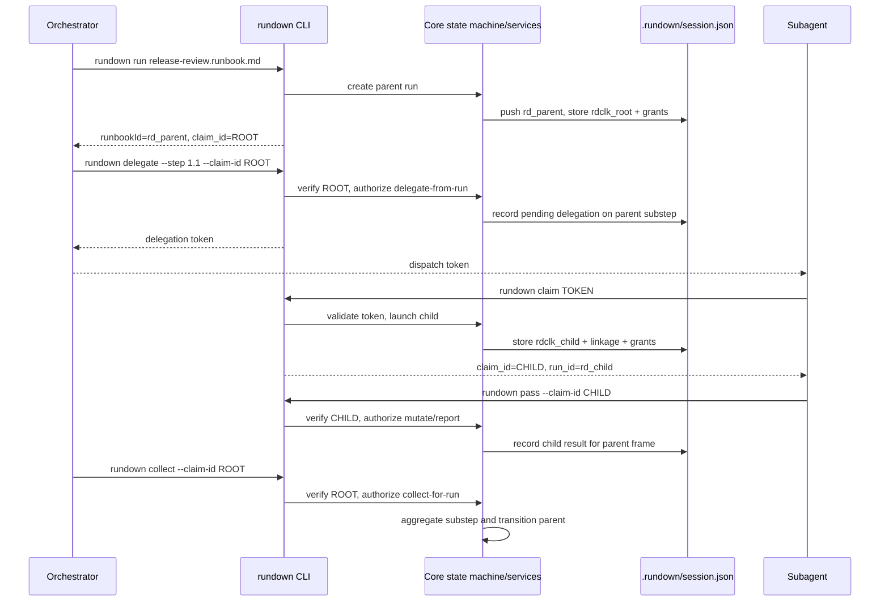
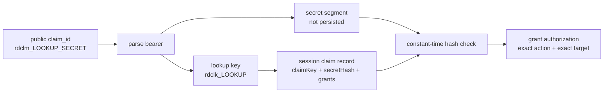

# Subagent Delegation

How Rundown delegates substep execution to subagents via the plugin's hook
system.

**Related docs:**

- [docs/reference/cli.md](../reference/cli.md) — CLI command reference and user
  guide
- [docs/reference/runtime.md](../reference/runtime.md) — Execution model, state,
  variables
- [docs/spec/language.md](../spec/language.md) — Rundown format specification
  (steps, substeps, transitions)
- [runbooks/](../../runbooks/) — Runbook pattern examples

---

## Delegation Workflow

A runbook defines substeps, each delegated to a subagent. The parent agent
orchestrates; subagents execute. The plugin's hook system handles
delegation-token detection and result routing.

Two flows are available:

- **DELEGATE annotation** (recommended for multi-substep delegation) — the step
  declares its substeps are delegated, and the engine auto-issues tokens on step
  entry. See [DELEGATE Annotation](#delegate-annotation).
- **Manual `rundown delegate --step`** — for single-delegation or ad-hoc
  dispatch from an orchestrating agent, but only against an authored
  `- DELEGATE` substep. Plain runbook-list substeps are inline composition
  targets.

### Single-Level Delegation Invariant

Delegation is single-level: a claimed (delegated) child runbook may not issue
further delegations. Subagents do not spawn subagents. The CLI enforces this at
runtime at the issuance source (`createDelegation`), so the rule covers every
path that mints a token: manual `rundown delegate`, the executor's auto-fan-out
on entry to a step with delegating substeps, and `rundown delegate --retry`
re-issuance. Issuance refuses with error `RD-819 DELEGATION_NESTED_FORBIDDEN`
when the active runbook is itself a delegated child.

When a claimed child needs to invoke another runbook, use composition
(`rundown run`) inside a substep body — composition is unrestricted. The
fenced-bash form is parsed as a shell command rather than a delegation list:

````markdown
### 1.1 Compose another runbook

```bash
rundown run other.runbook.md
```
````

Claimed children are never pushed onto `defaultStack`; bare commands always
target the project-default active runbook (the parent), and claim-targeted
commands (`pass`, `fail`, `stop`, `complete`, `goto`, `status`, `stash`, `pop`,
`collect`, and parent-side `delegate`) require explicit `--claim-id`.
`rundown delegate --claim-id` is for an orchestrator proving authority over the
parent run it controls; it cannot be used by a claimed child to bypass the
single-level delegation invariant.

### Claim Architecture Walkthrough

Claims are the single public authority primitive for mutating runs. A `run_id`
identifies state; a `claim_id` authorizes an operation after core verifies the
bearer secret and checks the claim's explicit grants.

The overall shape is:



Use this parent runbook:

```markdown
# Release Review

## 1. Dispatch reviews
- PASS ALL CONTINUE
- FAIL ANY STOP

### 1.1 Check implementation
- DELEGATE
- implementation-review.runbook.md

## 2. Publish result
Summarize the review outcome.
```

And this delegated child:

```markdown
# Implementation Review

## 1. Inspect implementation
Review the diff for correctness, type safety, and test coverage.

## 2. Record verdict
Pass only when the implementation is ready to merge.
```

The trace starts when the orchestrator launches the parent:

```bash
rundown run release-review.runbook.md
```

`rundown run` creates a parent run state, pushes that run onto
`.rundown/session.json`'s `defaultStack`, and returns both the parent
`runbookId` and a root `claim_id`. The root claim is stored as proof-backed
session data, not as a reusable bearer credential:

```json
{
  "defaultStack": ["rd_parent"],
  "claims": {
    "rdclk_root": {
      "claimKey": "rdclk_root",
      "secretHash": "sha256:...",
      "controlledRunId": "rd_parent",
      "grants": [
        { "action": "mutate-run", "runId": "rd_parent" },
        { "action": "delegate-from-run", "runId": "rd_parent" },
        { "action": "collect-for-run", "runId": "rd_parent" },
        { "action": "abort-delegation", "runId": "rd_parent" },
        { "action": "retry-delegation", "runId": "rd_parent" }
      ]
    }
  }
}
```

The public `claim_id` has two parts: an `rdclm_...` lookup segment and a secret
segment. The session persists only the derived `rdclk_...` lookup key and a hash
of the secret segment.



When the parent reaches step `1`, the authored `- DELEGATE` substep creates a
delegation frontier. The orchestrator can use the auto-issued token from the
`step_entered.delegateFrontier` event, or explicitly issue the same delegation:

```bash
rundown delegate --step 1.1 --claim-id "$ROOT_CLAIM_ID"
```

Core resolves the target parent run, verifies `$ROOT_CLAIM_ID`, and checks for a
`delegate-from-run` grant on `rd_parent`. The command records a pending
delegation on substep `1.1` and prints a delegation token. That token is not a
mutation authority for normal commands; it is a one-time handoff used by the
subagent to claim the child work.

The subagent claims that token:

```bash
rundown claim "$DELEGATION_TOKEN"
```

Claiming validates the token against the parent delegation, launches or resumes
the delegated child run, links the child back to the exact parent frame, and
returns a new child `claim_id`:

```json
{
  "action": "claimed",
  "claim_id": "rdclm_child_...",
  "run_id": "rd_child",
  "parent_run_id": "rd_parent",
  "parent_step": "1.1"
}
```

The session now has two independent claim records:

```json
{
  "defaultStack": ["rd_parent"],
  "claims": {
    "rdclk_root": {
      "controlledRunId": "rd_parent",
      "grants": [
        { "action": "mutate-run", "runId": "rd_parent" },
        { "action": "delegate-from-run", "runId": "rd_parent" },
        { "action": "collect-for-run", "runId": "rd_parent" }
      ]
    },
    "rdclk_child": {
      "controlledRunId": "rd_child",
      "delegation": {
        "childRunId": "rd_child",
        "parentRunId": "rd_parent",
        "parentStepId": "1.1",
        "parentFrameKey": "1|",
        "parentEntry": 1,
        "tokenHash": "sha256:..."
      },
      "grants": [
        { "action": "mutate-run", "runId": "rd_child" },
        { "action": "collect-for-run", "runId": "rd_child" },
        {
          "action": "report-delegation-result",
          "childRunId": "rd_child",
          "parentRunId": "rd_parent",
          "parentStepId": "1.1",
          "parentFrameKey": "1|",
          "parentEntry": 1,
          "tokenHash": "sha256:..."
        }
      ]
    }
  }
}
```



```mermaid
flowchart TB
    Session[".rundown/session.json"]
    Stack["defaultStack<br/>rd_parent"]
    Root["rdclk_root record<br/>controls rd_parent"]
    Child["rdclk_child record<br/>controls rd_child"]
    ParentRun["run state rd_parent"]
    ChildRun["run state rd_child"]
    Linkage["delegation linkage<br/>parent=rd_parent<br/>step=1.1<br/>frame=1&#124;<br/>entry=1"]
    RootGrants["root grants<br/>mutate/delegate/collect parent"]
    ChildGrants["child grants<br/>mutate child<br/>report result to parent linkage"]

    Session --> Stack
    Session --> Root
    Session --> Child
    Stack --> ParentRun
    Root --> RootGrants
    RootGrants --> ParentRun
    Child --> ChildRun
    Child --> Linkage
    Child --> ChildGrants
    Linkage --> ParentRun
    ChildGrants --> ChildRun
    ChildGrants --> Linkage

    ChildRun -. "not on defaultStack" .-> Stack
```

`rd_child` is not pushed onto `defaultStack`. The subagent must route every
mutation through its child claim:

```bash
rundown status --claim-id "$CHILD_CLAIM_ID"
rundown pass --claim-id "$CHILD_CLAIM_ID"
```

For each mutation, core parses the presented bearer, finds the `rdclk_...`
record, verifies the secret hash, resolves the target child run, and checks the
matching grant. When the child reports its result, the
`report-delegation-result` grant is checked against the exact delegation
linkage: child run, parent run, parent step, frame key, entry counter, and token
hash. This prevents a stale completion from a previous visit to step `1.1` from
being applied to a later visit.

After the child reports, the parent aggregates the delegated result:

```bash
rundown collect --claim-id "$ROOT_CLAIM_ID"
```

The root claim authorizes `collect-for-run` on the parent. Collection applies
the child's reported PASS/FAIL to substep `1.1`, evaluates the parent aggregate
transition (`PASS ALL CONTINUE` or `FAIL ANY STOP`), and advances or stops the
parent through the state machine.

### Manual `rundown delegate --step`

**Example runbook:**

```markdown
## 2. Review changes
- PASS ALL CONTINUE
- FAIL ANY GOTO 4

### 2.1 Code review
- DELEGATE

Review the implementation for correctness and style.

- code-review.runbook.md

### 2.2 Test review
- DELEGATE

Verify test coverage and assertions.

- test-review.runbook.md
```

**Command sequence:**

```bash
# 1. Parent starts the runbook and captures the root claim_id
rundown run parent.runbook.md

# 2. Parent delegates an authored DELEGATE substep using its root claim
rundown delegate --step 2.1 --claim-id <root_claim_id>

# 3. Parent dispatches a subagent with the token in its prompt
#    The plugin detects the token and injects claim instructions

# 4. Subagent claims the delegation token
rundown claim <token>

# 5. Subagent works through the delegated runbook, then reports result
rundown pass --claim-id <claim_id>   # or: rundown fail --claim-id <claim_id>
```

### Dispatch Frontier and Identity

- `delegate --step` requires a parseable step identifier; when the active step
  has substeps, step-only dispatch (`N`) is rejected — use qualified IDs
  (`N.M`).
- `delegate [runbook] --step <id>` accepts an optional runbook argument; when
  omitted, the runbook is inferred from the DELEGATE substep's `runbooks` field.
- Manual delegation is gated by author intent. The target substep must carry
  `- DELEGATE` directly or inherit it from a step-level `- DELEGATE`, and an
  explicit runbook argument must match an authored runbook reference on that
  substep.
- If the engine already auto-issued a frontier token for the substep, a later
  manual `rundown delegate` reports the in-flight delegation and reprints the
  pending token so an orchestrator can recover from lost local output.
- `delegate --step` is constrained to the active step frontier.
- If the active step is in a FOR loop, queueing is constrained to the active
  iteration frontier.
- Plugin dispatch descriptions must begin with a step identifier matching the
  runbook's ID format — either a numeric qualified ID (e.g., `1.2 - Review`) or
  a named identifier (e.g., `ErrorHandler: Recover`).

---

## DELEGATE Annotation

`- DELEGATE` is a structural bullet annotation that marks substeps for
delegation. When the parent step is entered, the execution engine auto-issues a
delegation token for each marked substep, so the orchestrating agent does not
need to call `rundown delegate` per substep. This is the recommended flow for
any step that delegates more than one substep to subagents.

See [docs/spec/language.md §7](../spec/language.md#7-delegation) for the full
format specification and
[docs/spec/grammar.md](../spec/grammar.md#delegate-annotation) for the grammar.

### Three equivalent forms

**Step-level** — propagates to all H3 substeps; use when every substep is
delegated:

```markdown
## 1. Delegated work
- DELEGATE
- PASS ALL CONTINUE
- FAIL ANY STOP

### 1.1 First task
- child-a.runbook.md

### 1.2 Second task
- child-b.runbook.md
```

**Per-substep** — on individual H3 substeps; use when a step mixes delegated and
non-delegated substeps:

```markdown
### 1.1 First task
- DELEGATE
- child-a.runbook.md
```

**Runbook-list shorthand** — nested under runbook-list entries (no H3 headers);
use when the step body is already a flat runbook list:

```markdown
## 1. Delegated work
- child-a.runbook.md
  - DELEGATE
- child-b.runbook.md
  - DELEGATE
```

Executable scenarios for all three forms live at
[runbooks/delegation/delegate-keyword-\*.runbook.md](../../runbooks/delegation/).

### Auto-issuance lifecycle

1. **Step entry** — the engine fires `STEP_ENTERED` with a `delegateFrontier`
   field: an array of `{id, runbook, token}` records, one per DELEGATE substep
   at the active frontier.
2. **Dispatch** — the orchestrating agent dispatches a subagent per record,
   passing the token in the subagent's prompt. The plugin detects the token and
   injects claim instructions.
3. **Claim** — each subagent runs `rundown claim <token>`, which launches the
   child runbook with the inherited `ContextId` and any forwarded variables. The
   command returns a `claim_id`; keep that handle and pass it to every
   child-targeting command (`rundown status`, `rundown pass`, `rundown fail`,
   `rundown collect`, `rundown goto`, `rundown stash`, `rundown pop`,
   `rundown stop`, and `rundown complete`) with `--claim-id <claim_id>`.
4. **Resolve** — the subagent completes the child runbook and calls
   `rundown pass --claim-id <claim_id>` / `rundown fail --claim-id <claim_id>`.
5. **Report then collect** — each child reports its terminal result to the
   parent, then the orchestrator runs `rundown collect --claim-id <claim_id>` to
   apply the reported results and fire the parent step transition.

### `rundown collect`

```bash
rundown collect --claim-id <claim_id>              # Aggregate the active DELEGATE step and fire its transition
rundown collect --claim-id <claim_id> --step <id>  # Target a specific substep scope
```

Delegated children report terminal results to the parent, but the parent applies
those reported results through `rundown collect`. This keeps report and
aggregation as separate steps. On a delegation-exposed run, pass the claim id
for the actor controlling that run.

### RETRY on DELEGATE

`RETRY` on a DELEGATE step fires uniform re-delegation. When aggregation
resolves to a failure and the retry budget is non-zero, the engine cancels every
delegated substep's active delegation in the frame and mints a fresh token per
substep — every substep is re-delegated, not just the failures. Stale tokens
from the previous attempt return `TOKEN_CANCELLED` on `rundown claim`. The
subsequent `STEP_ENTERED` event carries the new `delegateFrontier`;
orchestrators dispatch a subagent per fresh token exactly as they do on first
entry. For DELEGATE steps inside a FOR loop, retry budgets apply per iteration.

---

## Namespaces

Runbook and agent-type names support namespace prefixes using `namespace:name`
syntax (e.g., `rundown:write-plan`). For runbook resolution, the `rundown`
namespace targets the plugin source explicitly; bare names resolve via the
priority chain (project, plugin, bundled). See
[Runbook Discovery](../../CLAUDE.md#runbook-discovery) for the full resolution
rules.

---

## Threat Model and Claim IDs

Claim ids are bearer credentials for a trusted local workspace. They are a
strong accident barrier between cooperating agents, but they are not an
adversarial sandbox boundary.

`rundown run <runbook>` returns a generated `rdclm_...` bearer for the started
run. `rundown claim <token>` returns a generated `rdclm_...` bearer for the
claimed delegated child. The full bearer is not persisted:
`.rundown/session.json` stores a non-secret `rdclk_...` lookup key, a hash of
the bearer secret segment, the controlled run id, optional delegation linkage,
and explicit grants. CLI commands that accept `--claim-id` (`rundown status`,
`rundown pass`, `rundown fail`, `rundown collect`, `rundown goto`,
`rundown stash`, `rundown pop`, parent-side `rundown delegate`, `rundown stop`,
and `rundown complete`) verify the bearer and route to the exact authorized run.
Plain commands continue to target only the default stack, and mutating commands
on delegation-exposed runs refuse bare authority.

What this provides:

- **Sibling fan-out isolation.** Two subagents claiming different delegation
  tokens against the same parent each operate on their own child runbook.
  `rundown pass --claim-id <id-a>` cannot accidentally complete the child for
  `<id-b>`.
- **Stash protection.** A claimed child stashed with
  `rundown stash --claim-id <id>` can be restored only with
  `rundown pop --claim-id <id>`; plain `rundown pop` refuses it.
- **Fail-closed targeting.** A stale, terminal, missing, or unlinked claim id
  fails instead of falling back to the shared default stack.
- **Identifier-only resistance.** A leaked `run_id` or persisted `rdclk_...`
  lookup key cannot authorize mutation without the bearer secret segment.

What this does **not** provide:

- **No transcript secrecy.** Claim ids are printed to local command output. Any
  process or agent that can read the command transcript can use the bearer.
- **No authentication of the dispatching session.** The plugin trusts the local
  workspace state and the CLI trusts any syntactically valid claim id supplied
  by the caller after the bearer proof verifies.
- **No protection against a malicious local process.** All workspace state
  (`.rundown/`) is filesystem-readable and writable by the user; an actor with
  shell access can edit files directly or replay a claim id it observed.

The threat model assumes cooperating agents in a trusted local workspace. If you
need adversarial isolation between agents, run them in separate workspaces or as
separate operating-system users — not as cooperating processes against the same
`.rundown/` directory.

---

## Delegation Completion

Subagents complete delegated work using `rundown pass --claim-id <claim_id>` or
`rundown fail --claim-id <claim_id>`, which updates the child runbook state
directly. The parent agent observes results via `rundown status`.

Parallel delegated siblings are isolated by claim id. A subagent that claims
token A receives the handle for token A's child, even if another subagent later
claims token B in the same workspace. Plain `rundown pass` and `rundown fail` do
not target claimed children.

The plugin tracks active delegation tokens per `agent_id` for `SubagentStop`
diagnostics. When one subagent stops, the hook consumes only that agent's token
metadata and preserves sibling token metadata.

When a subagent stops without explicitly closing the delegated work, the plugin
reports a diagnostic to the parent:

- **Child completed** (`rundown pass --claim-id`/`rundown fail --claim-id` was
  called): The child runbook has already propagated the result to the parent. No
  action needed.
- **Child not explicitly closed**: The plugin tells the parent that delegated
  Rundown work must be closed explicitly with
  `rundown pass --claim-id <claim_id>` or `rundown fail --claim-id <claim_id>`.

The plugin never destroys child runbook state. Incomplete delegations preserve
their context for inspection.

**Routing behavior:**

- Canonical target identity is `step + substep + iteration`
  (`frame = step|iteration`, `entry = re-entry counter`).
- Completion keys are scoped to `frame + entry + substep`; stale completions
  from previous entries are rejected.
- Resolved completions drain in deterministic substep order. Aggregation waits
  for all DEFER'd results before evaluating the step-level transition.
- When a completion arrives for a frontier substep that is not at the active
  cursor, it is **deferred** — stored and applied when the cursor reaches that
  substep.

**Data flow between parent and child:** Delegated runbooks exchange values
through context passing — a parent step's `- OUTPUTS` directive writes values
into the live machine variable space when that step transition completes, and
frontmatter `outputs:` writes terminal values into `state.finalVars`. Children
inherit the parent's `ContextId` via `--input`, and parent/child hand-off
happens through forwarded live vars and `finalVars`, not through a shared
`outputs.json` file.

See
[Section 6: Transitions and Actions](../spec/language.md#6-transitions-and-actions)
for transition semantics.

---

## Aggregate Transitions

When substeps involve agents, transition rules use aggregate conditions:

```markdown
## 2. Review
- PASS ALL CONTINUE
- FAIL ANY GOTO 4

### 2.1 First reviewer
### 2.2 Second reviewer
```

| Condition       | Meaning                                                  |
| --------------- | -------------------------------------------------------- |
| `PASS ALL`      | All substep agents passed (pair with `FAIL ANY`)         |
| `FAIL ANY`      | At least one substep agent failed (pair with `PASS ALL`) |
| `PASS ANY`      | At least one substep agent passed (pair with `FAIL ALL`) |
| `FAIL ALL`      | All substep agents failed (pair with `PASS ANY`)         |
| `PASS` / `FAIL` | Standard single-result transitions                       |

See [docs/spec/language.md](../spec/language.md) for the full transition
grammar.
