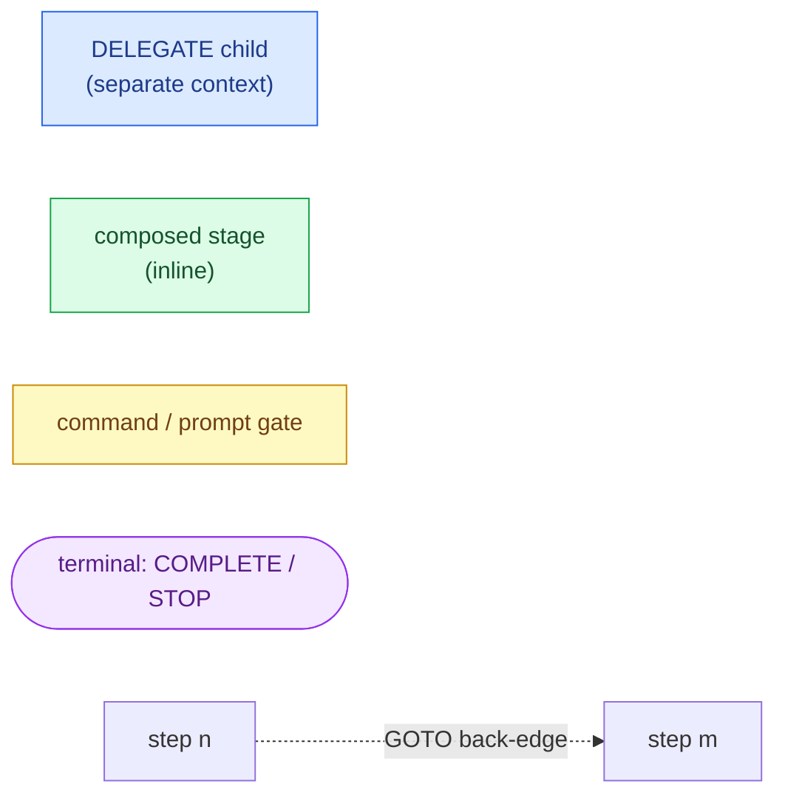
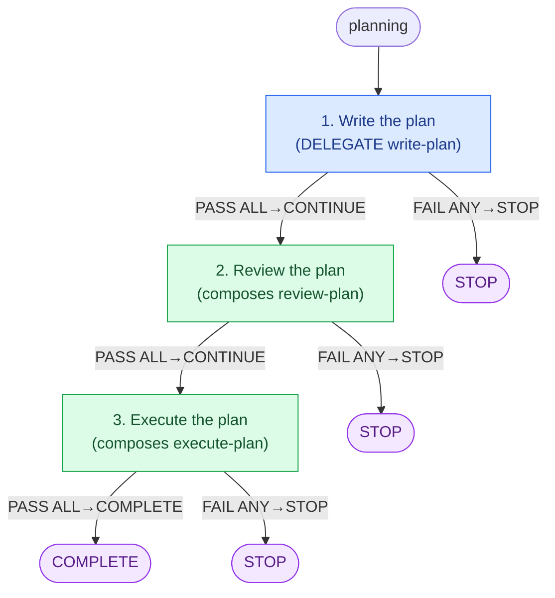
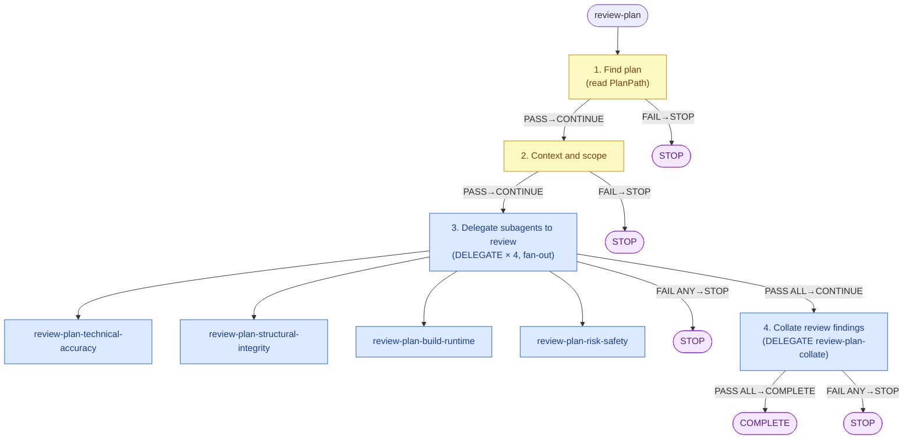
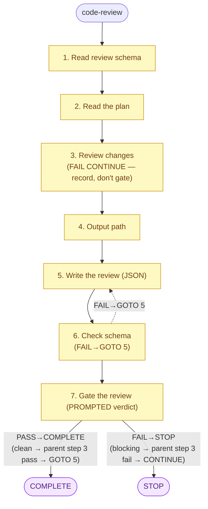

# Planning Pipeline Flow

The `planning` runbook is a three-stage pipeline — **write the plan**, **review
the plan**, **execute the plan** — composed from smaller runbooks under
`packages/claude-code-plugin/runbooks/planning/` (with the four reviewer
runbooks and the collator under the `planning/review/` subdirectory). The
discipline is consistent: the top-level orchestrator
(`planning/planning.runbook.md`) and `execute-plan` push real work to
**delegated children** (a `- DELEGATE` step hands a child runbook to a separate
agent/context, whose terminal lifecycle maps back to the parent's result — child
`COMPLETE` → parent `pass`, child `STOP` → parent `fail`), while orchestration
runbooks that simply sequence other runbooks **compose** them (a substep list
with no `- DELEGATE` marker runs inline in the same context). A delegated step
that lists a single child is a _leaf delegate_; a fan-out step lists several
children and aggregates them with `PASS ALL` / `FAIL ANY`.

The gates worth tracking are all in `execute-plan`: the **code-review verdict
loop** (code review fails → address findings → re-review) and the **verify
loop** (verify fails → address findings → re-review → re-verify). The
code-review child owns its own verdict via a final prompted gate step; there is
no separate `jq` gate in `execute-plan`.

## Legend



- **DELEGATE child** (blue): step hands a child runbook to a separate
  agent/context; the child's terminal status maps back to the parent —
  `COMPLETE` → parent `pass`, `STOP` → parent `fail`.
- **composed stage** (green): substep list runs inline in the current context.
- **command / prompt gate** (yellow): a step whose result comes from a shell
  command or a prompted human/agent verdict.
- **GOTO back-edge** (dotted): a `GOTO <n>` jump, usually looping backward.
- **terminal** (purple, stadium): `COMPLETE` (success) or `STOP` (failure) ends
  the runbook.

## 1. Top-level: `planning` (write → review → execute)

`planning/planning.runbook.md`. Step 1 is a leaf DELEGATE; steps 2 and 3 compose
their stage runbooks inline. Every step stops the pipeline on failure
(`FAIL ANY STOP`); the final stage completes it (`PASS ALL COMPLETE`).



## 2. Review stage: `review-plan` (fan-out + collate)

`planning/review-plan.runbook.md`. Steps 1–2 are inline find/context checks.
Step 3 is a DELEGATE **fan-out** to four reviewer runbooks, aggregated
`PASS ALL CONTINUE` / `FAIL ANY STOP`. Step 4 is a leaf DELEGATE to the
collator, which completes the stage.



Each reviewer runbook writes a `*-review-plan-*-*.json` file and self-completes;
the four findings flagged in their step 3 use `FAIL CONTINUE` so a finding
records into the JSON rather than failing the reviewer — a reviewer only `STOP`s
on operational failure (e.g. missing schema). `review-plan-collate` merges and
deduplicates those files into `ReviewPlanPath`.

## 3. Execute stage: `execute-plan` (review loop + verify loop)

`planning/execute-plan.runbook.md`. Step 1 reads the skill inline. Steps 2–4 are
DELEGATE children; step 5 is a shell-command gate. Two loops:

- **Code-review verdict loop:** step 3 delegates `code-review`. Its child's
  terminal status _is_ the verdict (its step 7 prompted gate: clean →
  `COMPLETE`, blocking findings → `STOP`). Child `COMPLETE` → step 3 `pass` →
  `GOTO 5` (skip straight to verify). Child `STOP` → step 3 `fail` → `CONTINUE`
  to step 4 (address). Step 4 (`address-review`) on success loops `GOTO 3` to
  re-review.
- **Verify loop:** step 5 runs `npm run verify`. Pass → `COMPLETE`. Fail →
  `GOTO 4` to address the verify failure, which re-reviews (`GOTO 3`) and
  re-verifies.

```mermaid
flowchart TD
  start([execute-plan]) --> e1

  e1["1. Invoke executing-plans skill"]:::gate
  e1 -- "PASS→CONTINUE" --> e2
  e1 -- "FAIL→STOP" --> stopE1(["STOP"]):::terminal

  e2["2. Implement the plan<br/>(DELEGATE implement-plan)"]:::delegate
  e2 -- "PASS ALL→CONTINUE" --> e3
  e2 -- "FAIL ANY→STOP" --> stopE2(["STOP"]):::terminal

  e3["3. Code review<br/>(DELEGATE code-review)"]:::delegate
  e4["4. Address review findings<br/>(DELEGATE address-review)"]:::delegate
  e5["5. Verify<br/>(npm run verify)"]:::gate

  e3 -- "PASS ALL→GOTO 5<br/>(review clean)" --> e5
  e3 -- "FAIL ANY→CONTINUE<br/>(blocking findings)" --> e4

  e4 -- "PASS ALL→GOTO 3<br/>(re-review)" -.-> e3
  e4 -- "FAIL ANY→STOP" --> stopE4(["STOP"]):::terminal

  e5 -- "PASS→COMPLETE" --> doneE(["COMPLETE"]):::terminal
  e5 -- "FAIL→GOTO 4<br/>(fix & re-verify)" -.-> e4

  classDef delegate fill:#dbeafe,stroke:#2563eb,color:#1e3a8a;
  classDef gate fill:#fef9c3,stroke:#ca8a04,color:#713f12;
  classDef terminal fill:#f3e8ff,stroke:#9333ea,color:#581c87;
```

### How `code-review`'s verdict drives execute-plan step 3

`planning/code-review.runbook.md` records findings then renders the verdict in
its **final prompted gate** (step 7), which is what the parent reads:



`implement-plan` (step 2 child) and `address-review` (step 4 child) are both
straightforward executing-plans children: read the plan (and, for
`address-review`, the recorded findings), do the work committing per task, then
`COMPLETE` on success or `STOP` when blocked.
