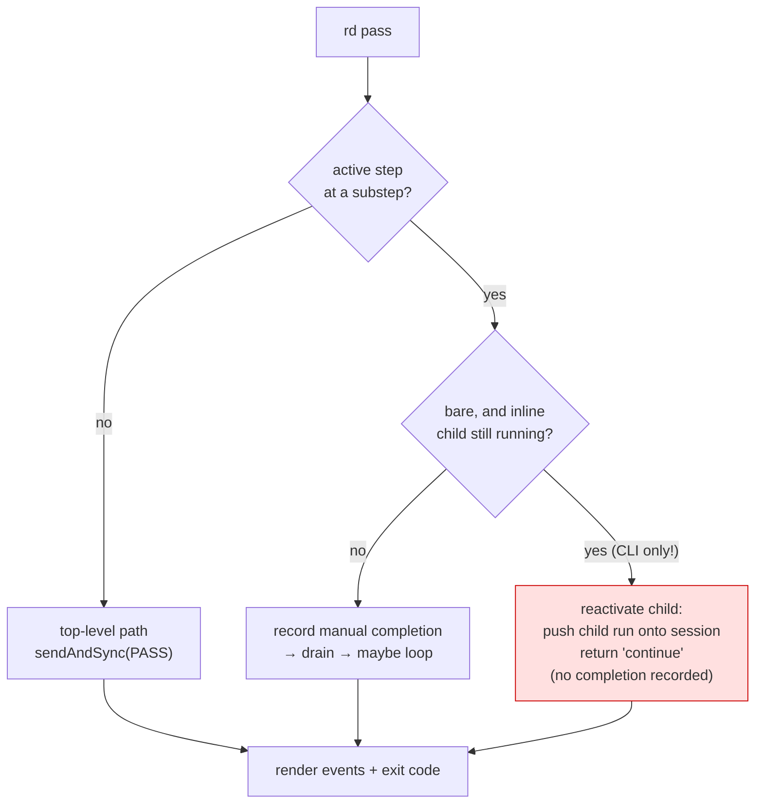
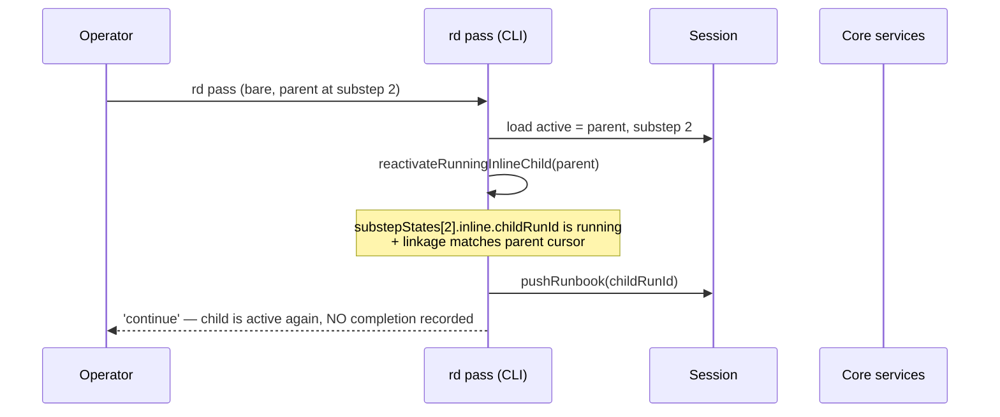
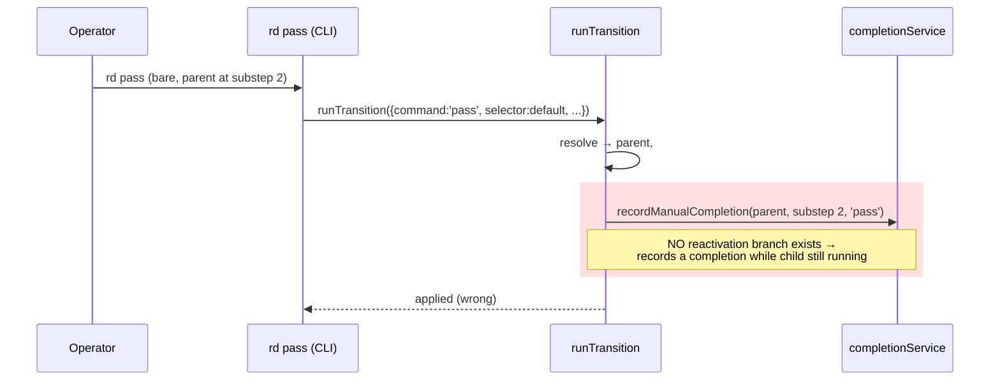
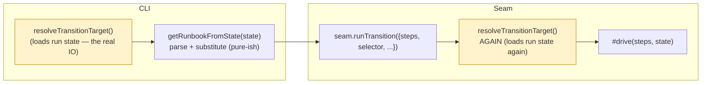
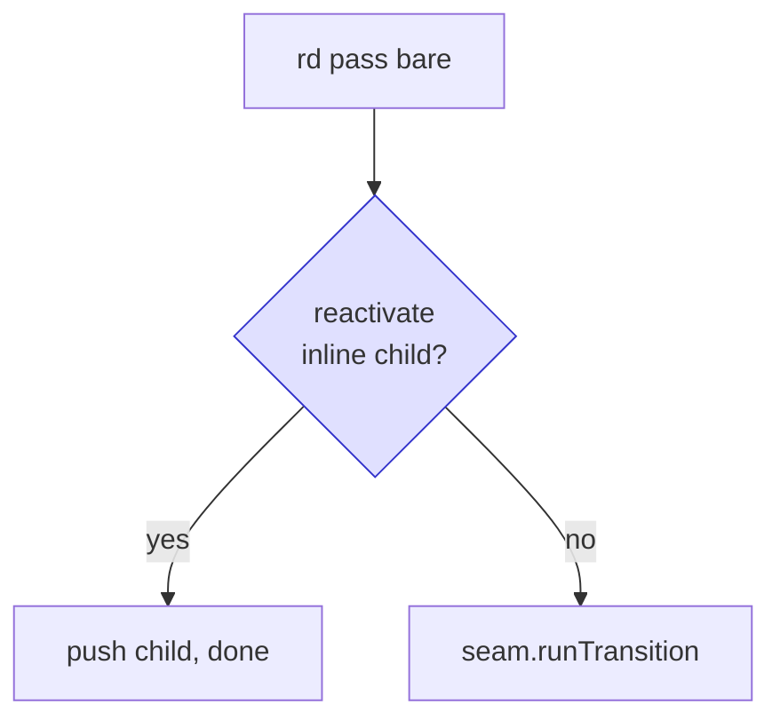
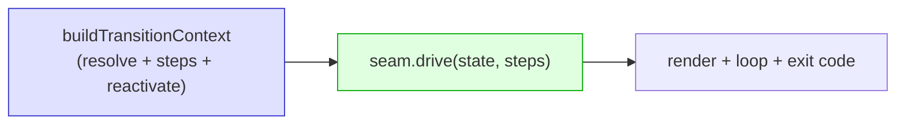

# Task 7 — `pass`/`fail` seam migration: the design fork

> **Status:** **DECIDED — Option B.** Prospective design note for Task 7 of
> `docs/superpowers/plans/2026-06-28-core-lifecycle-command-seam.md`
> ("Migrate `pass` and `fail` to the seam + retire `directCliCompatibility`").
> Written to make the migration's two non-mechanical problems concrete before
> code lands. Tasks 5 and 6 are already merged; this note is what blocked Task 7
> from being a straight find-and-replace. The fork is now resolved in favour of
> **Option B** (extend the seam now: move inline-child reactivation into core and
> resolve once via an injected `loadSteps(state)` callable); Task 7 in the plan
> has been rewritten to encode it.

## TL;DR

Routing bare `rd pass` / `rd fail` straight through
`RunbookLifecycleCommandService.runTransition` looks mechanical but isn't,
because of two coupled facts:

1. **Inline-child reactivation gap** — the CLI today has a behaviour the seam
   does not: a *bare* `rd pass` at a substep whose inline child is still running
   **resumes the child** instead of recording a completion. Route the same call
   through the seam and it records a completion → inline handoff regresses.
2. **Resolve/steps tension** — `runTransition` resolves the target run *itself*,
   but also requires the parsed `steps` as an input. The CLI can only derive
   `steps` *after* it knows which run resolved (steps come from parsing the
   resolved state's in-memory `runbookSrc` — *not* a runbook-file read; the real
   IO is the run-state load inside resolution). So the CLI resolves once to get
   the state, derives steps, and the seam resolves again — a redundant run-state
   read, not redundant runbook-file IO.

Neither is a bug in Task 4's seam; both are seams the plan left for Task 7 to
decide. This note shows each with runnable runbooks and diagrams, then lays out
the three ways forward.

---

## Background: what `rd pass` does today

`rd pass` / `rd fail` share one flow that splits into **two mutation paths**
(pinned in `docs/superpowers/notes/2026-06-28-lifecycle-command-seam-contract.md`):

| Path | When | What happens |
| --- | --- | --- |
| **Top-level** | active step is a normal step | `sendAndSync(PASS\|FAIL)` → observe → maybe run the execution loop |
| **Substep / manual completion** | active step is at a substep | record a manual completion → drain → maybe run the execution loop |

The seam (`runTransition`) already implements **both** paths. The catch is what
the *substep* path does *before* recording — see Issue 1.



The pink box is the logic that lives **only** in the CLI
(`packages/cli/src/helpers/transitions.ts:438` `reactivateRunningInlineChild`,
called at `:673`). The seam's `#driveSubstep` has no equivalent — it always
takes the `record` branch.

---

## Issue 1 — the inline-child reactivation gap

### What an "inline child" is

A substep step can list a child runbook as a bullet. When the run **enters** that
step, the child is launched *inline*: it becomes its own run, and it is pushed
onto the session so the operator drives the child next. When the child
completes, control returns to the parent.

**`parent.runbook.md`**

```markdown
---
name: parent
required: [PlanPath]
inputs: [PlanPath]
---
# Parent

## 1. Start
- PASS CONTINUE

Ready.

## 2. Write
- PASS ALL CONTINUE
- FAIL ANY STOP

- child.runbook.md      <!-- inline child: launched when step 2 is entered -->

## 3. Review
- PASS COMPLETE

Reviewing {{PlanPath}}.
```

**`child.runbook.md`**

```markdown
---
name: child
outputs:
  - PlanPath "{{WorkPath}}/plan.md"
---
# Child

## 1. Create
- PASS COMPLETE

Child prompt.
```

### The operator sequence

```text
rd run parent.runbook.md --input PlanPath=/tmp/plan.md
rd pass            # step 1 PASS CONTINUE → enters step 2 → launches inline child
                   #   session active run is now the CHILD
rd pass            # child step 1 PASS COMPLETE → child done → control back to parent
rd pass            # parent step 2 aggregates → CONTINUE → step 3
rd pass            # step 3 PASS COMPLETE → parent done
```

The interesting moment is the **second `rd pass`**. The parent is parked at
substep `2`, and its inline child is *running*. What should a bare `rd pass`
do?

- **Correct (today):** the parent's substep is not yet resolvable — its child is
  still open. The bare `rd pass` is interpreted as "advance the thing the
  operator is actually looking at", i.e. **resume / re-target the running
  child**. No completion is recorded against the parent.
- **Wrong (naive seam):** record a manual `pass` completion against the parent's
  substep `2` while the child is still running — double-counting the substep and
  desyncing the parent/child handshake.

### Current CLI behaviour (correct)



### Naive seam routing (regression)



`reactivateRunningInlineChild` is exercised by integration suites
(`inline-child-launch`, `inline-linkage`, `delegation-inline-handoff`), so this
regression would be caught — but only after the migration is written. The point
of this note is to decide *where the branch lives* before writing it.

### Why it's genuinely ambiguous

Reactivation is **mixed-category**:

- the *decision* ("the child is still open, so resume it rather than record") is
  **runbook logic** → belongs in core (the seam);
- the *effect* (`SessionService.pushRunbook`) is **session orchestration** →
  core already owns `SessionService`, but the CLI calls it today.

So "move it into the seam" is the architecturally pure answer, but "keep it as a
CLI pre-check" is defensible as not-yet-migrated Category-A glue — exactly the
shape of the `delegate` transitional decision you already approved.

---

## Issue 2 — the resolve/steps tension

`runTransition` has this shape:

```ts
async runTransition(input: LifecycleTransitionInput) {
  // input.steps is REQUIRED ─────────────────┐
  const resolution = await resolveTransitionTarget(...); // ← but it ALSO resolves the run here
  return this.#drive(input /* uses input.steps */, resolution.state, ...);
}
```

The run that resolves determines **which runbook's steps** are needed:

- bare / `--step` → the **active** run's steps;
- `--claim-id` → the **claimed child** run's steps (a *different* runbook).

`steps` come from `getRunbookFromState(state, cwd)`. **This is not a runbook-file
read.** It parses the in-memory `state.runbookSrc` already carried in the
resolved state, then resolves FOR bounds and substitutes template variables
(`runbook-loader.ts:50-100`). The substantive work is `@rundown-org/parser` +
core (`parseRunbookDocument`, `resolveForBounds`, `substituteRunbookVariables`) —
pure computation; only `getHelperRegistry()` and `buildRunnableRenderContext` are
genuinely environment-bound (Category A). The actual file IO on this path is the
**run-state load during resolution** (`.rundown/runs/*.json`) — and the seam
*already owns that*, inside `resolveTransitionTarget`.

So the tension is **not** "Category-A file IO that legitimately lives in the
CLI." It is plain **data ordering**: `getRunbookFromState` needs the resolved
`state` before it can derive steps, and today the CLI derives steps *before*
calling the seam, which then resolves again to obtain the same `state`.



The two yellow boxes are the same core resolver — and the same run-state read —
run twice. It is **not a shadow implementation** (same core code, not a CLI
re-derivation) and the *decisive* write is still re-guarded atomically under the
session lock (`runGuardedParentAdvance`), so correctness holds. But it is
redundant IO and a slightly wider TOCTOU window between the two reads.

Because step derivation is parsing rather than disk access, the fix is cheaper
than a "move file IO into core" framing suggests. There's no clean way to pass
`steps` to the seam *and* have the seam own resolution without either (a)
resolving twice, or (b) changing the seam so the CLI hands it the already-resolved
target, or (c) the seam deriving steps itself from the resolved state's
`runbookSrc` via a small injected `loadSteps(state)` callable that carries only
the environment-bound helper/render context. Option (c) is modest precisely
because the only thing that has to cross the seam is the helper/render context,
not file IO.

---

## The three ways forward

### Option A — CLI pre-check + capture a follow-up (lowest risk)

- Keep `reactivateRunningInlineChild` as a CLI pre-check on the bare substep
  path (it's a session-push concern); only when it does **not** reactivate does
  the CLI call `seam.runTransition`.
- Accept the one redundant resolution.
- Retire `directCliCompatibility` (the bare path now flows through
  `CallerEvidence` → `actorContextFromEvidence`).
- Capture a follow-up to absorb reactivation + single-resolution into the seam
  later — the same transitional pattern approved for `delegate`.



- ➕ Smallest change to the committed Task 4 seam; lowest regression risk.
- ➕ Mirrors the `delegate` decision already on record.
- ➖ Reactivation stays in the CLI; double-resolution remains. Adds follow-up
  debt (explicitly tracked).

### Option B — extend the seam now (most pure)

- Move inline-child reactivation into the seam's `#driveSubstep` (core makes the
  decision and calls `SessionService.pushRunbook`).
- Rework the seam so it doesn't double-resolve: have the seam resolve once and
  derive steps itself from the resolved state's `runbookSrc`, with the CLI
  injecting only a small `loadSteps(state)` callable that carries the
  environment-bound helper registry + render context. (Per Issue 2, step
  derivation is parsing, not file IO — so the callable is thin: it does not hand
  the seam disk access, only the Category-A helper/render context the parser
  needs.)

- ➕ Architecturally clean: all runbook logic in core, one resolution (one
  run-state read), no follow-up debt.
- ➖ Largest change to an already-merged seam; needs new seam tests for
  reactivation + the `loadSteps` callable. The `loadSteps` seam is genuinely
  small (Issue 2 corrected), so the dominant cost is reactivation + retesting the
  merged seam, not the steps plumbing.

### Option C — hybrid: split resolve from drive

- Keep `buildTransitionContext` for resolve + steps-derivation + reactivation
  CLI-side (steps-derivation is parsing, not Category-A IO — see Issue 2), and
  expose a seam `drive(resolvedState, steps, …)` method so
  the seam owns gate + record/drain + sendAndSync + observe + terminal **without
  re-resolving**.



- ➕ No double resolution; seam owns the mutation core; reactivation stays put.
- ➖ Splits the seam's public surface (`runTransition` vs `drive`); resolution +
  the strict gate stay partly CLI-side, so `directCliCompatibility` retirement
  needs care (the gate must still run). Medium change.

---

## Recommendation

**Re-weighted after the Issue 2 correction.** The original note leaned on
"step-loading is Category-A file IO that legitimately lives in the CLI" to justify
A and to price B as the "largest change." That premise was wrong: the file IO is
the run-state read, which the seam already owns; step derivation is parsing plus
an environment-bound helper/render context. The single-resolution half of B is
therefore a thin `loadSteps(state)` callable, not a file-IO migration — most of
B's cost is the inline-child reactivation move, which A defers rather than
eliminates.

Given that, the two live options are:

- **Option B** is the architecturally correct answer and is now cheaper than the
  note first implied. It is the only option that satisfies CLAUDE.md's
  non-negotiable "the state machine drives Rundown logic / the CLI is a thin
  wrapper" principle outright — the inline-child reactivation *decision* is
  runbook logic and belongs in core. Prefer B if we can afford new seam tests for
  reactivation this cycle. The residual risk is editing an already-merged seam.

- **Option A** remains the right call *only* if merge-risk or cycle budget rules
  out touching the merged seam now. It is an explicit, tracked deferral —
  consistent with the `delegate` precedent — not a destination. If A is chosen,
  the follow-up to land B must be captured at the same time, and the tracked debt
  is specifically: (1) inline-child reactivation still in the CLI, and (2) the
  redundant run-state resolution. The "steps are file IO" rationale must **not**
  be cited as justification for leaving reactivation in the CLI — that rationale
  is retracted.

Option C (split `runTransition` into resolve-side + `drive`) stays a viable
middle path but splits the seam's public surface and leaves the strict gate
partly CLI-side, complicating `directCliCompatibility` retirement; prefer B over
C unless the seam-surface split is independently wanted.

The options considered were **B** (extend the seam now — recommended), **A**
(transitional CLI pre-check + a captured B follow-up as tracked debt), and **C**
(the resolve/drive split, available only if that split were independently
wanted). The decision taken is recorded below.

## Decision

**Option B (2026-06-28).** Extend the seam now: move inline-child reactivation
into core (`#driveSubstep` → `SessionService.pushRunbook`) and eliminate the
double-resolution by having the seam resolve once and derive steps in-seam via an
injected `loadSteps(state)` callable (the callable carries only the
environment-bound helper/render context, not file IO). Task 7 in the plan is
rewritten to encode this; no follow-up debt is carried.
