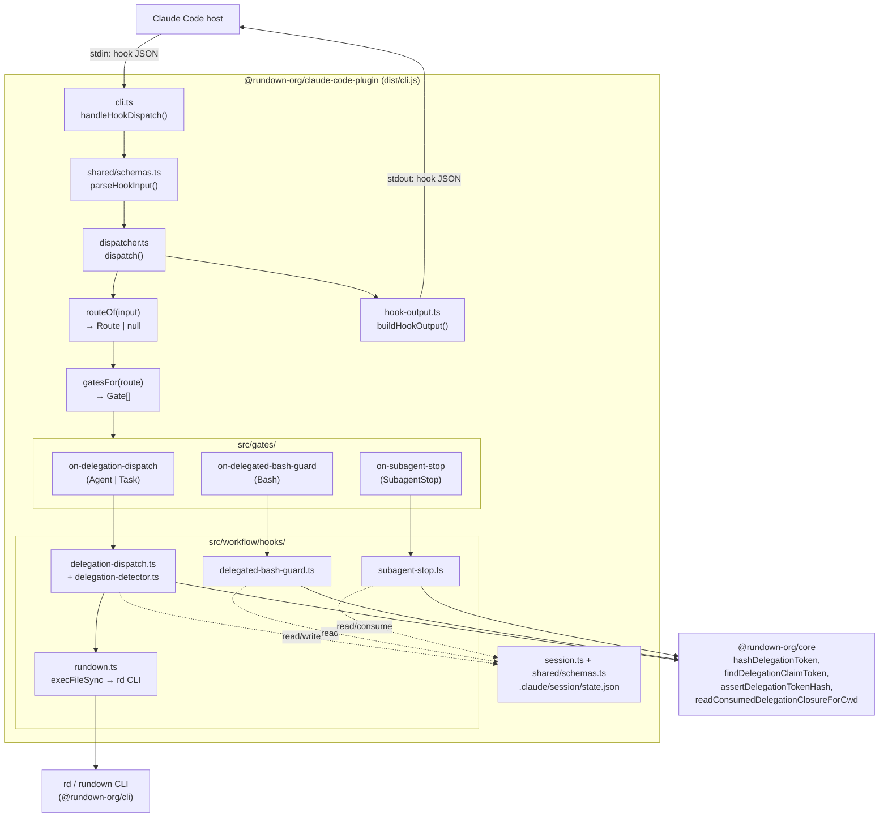
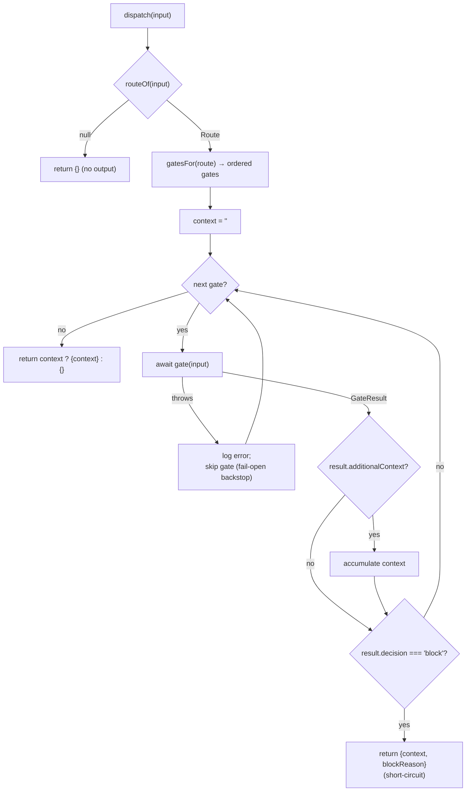
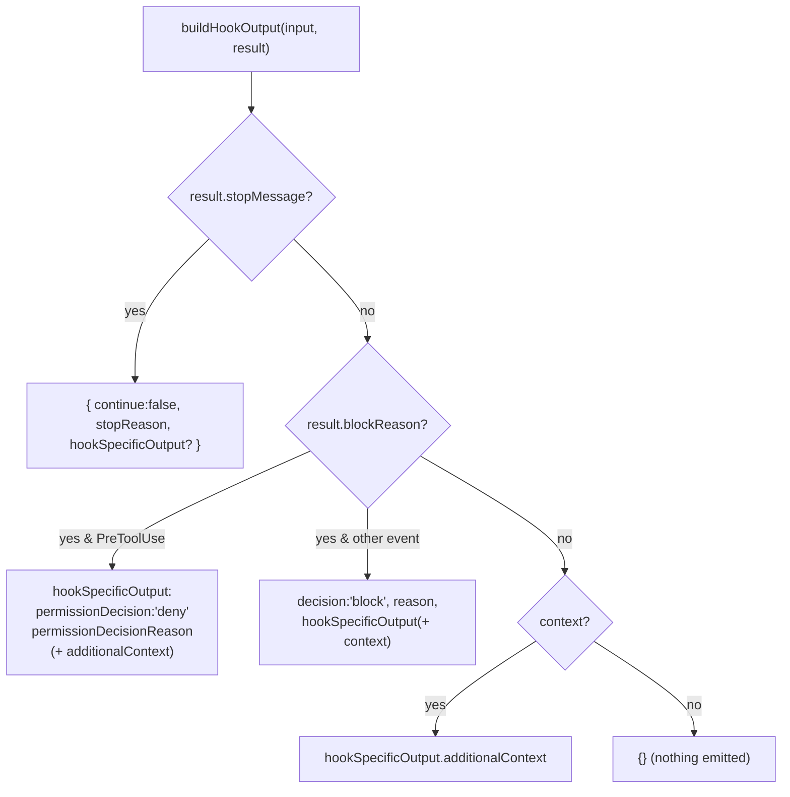
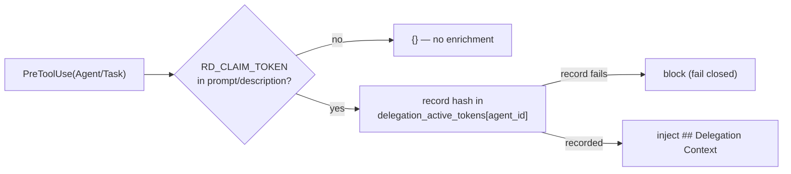
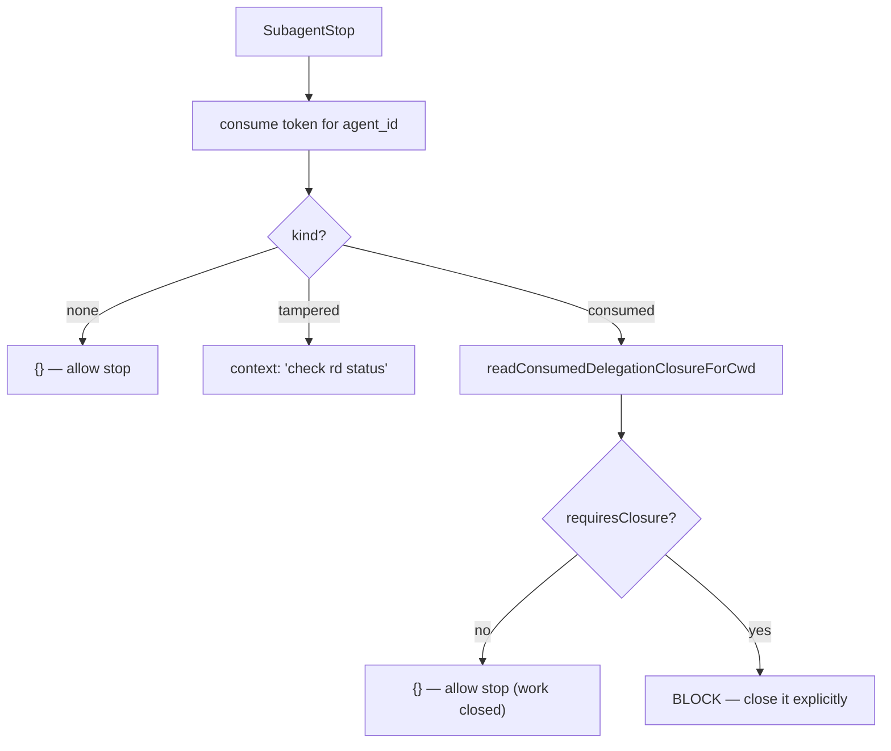
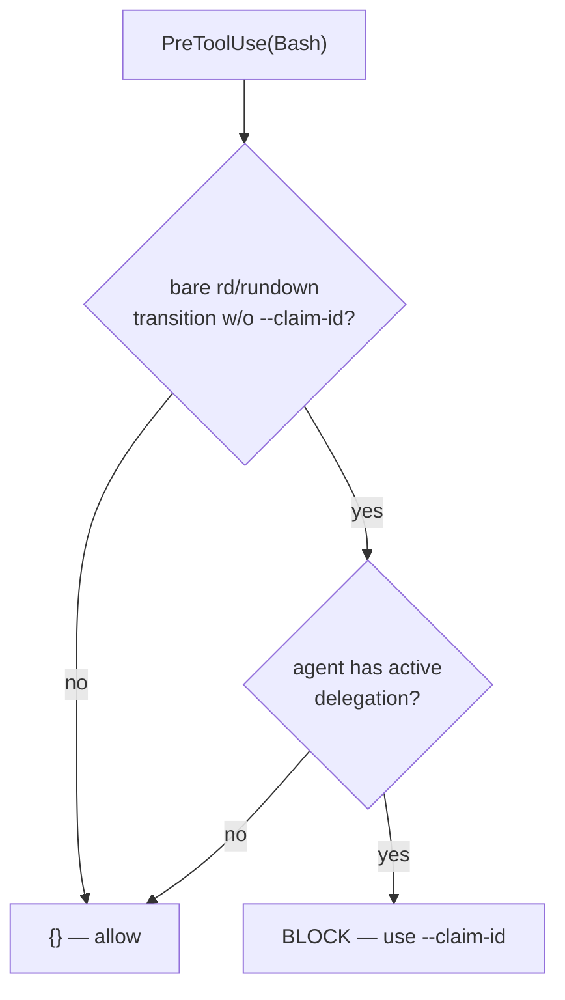
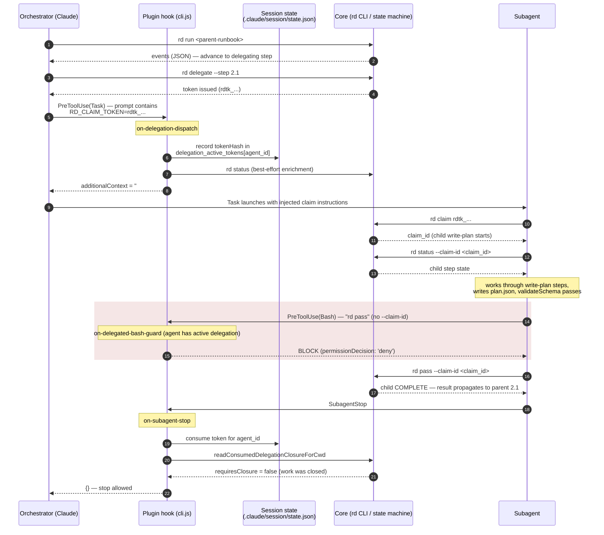

# Claude Code Plugin Overview

Developer-facing reference for `@rundown-org/claude-code-plugin` as it exists on
branch `#463` (post-minimization). This is descriptive documentation of the
current code, intended for engineers new to the plugin.

> **Where the logic lives.** The plugin is a **thin front-end** to
> `@rundown-org/core`. All runbook behaviour — step transitions, result
> aggregation, delegation lifecycle, closure rules — is owned by the XState state
> machine in core. The plugin never re-implements that logic; it calls core
> primitives (`hashDelegationToken`, `readConsumedDelegationClosureForCwd`,
> `assertDelegationTokenHash`, `findDelegationClaimToken`,
> `isDelegationTokenHash`) and the `rd`/`rundown` CLI. See the root
> [`CLAUDE.md`](../../../CLAUDE.md) architectural principles.

---

## 1. What exists (architecture)

The plugin is a single Node entry point (`dist/cli.js`) registered against two
native Claude Code hook events. It reads a hook payload on **stdin**, routes it
to one of three fixed delegation gates, and writes a hook-response JSON object on
**stdout**.

There is **no** repository-level gate config, **no** generic gate engine, and
**no** context files. Those were removed in this branch. The routing table is
fixed in code.

### 1.1 Component / containment diagram



### 1.2 The CLI entry point — `src/cli.ts`

The plugin's **only** CLI mode is native hook dispatch over stdin. The old
`session` / `log-path` / `log-dir` subcommands were removed; `main()` simply
calls `handleHookDispatch()`.

The flow (`cli.ts:15-108`):

1. Drain stdin into a UTF-8 string.
2. Empty input → emit `{ continue: false, stopReason: 'Empty input received' }`
   and `exit(1)`.
3. `parseHookInput(inputStr)` (`shared/schemas.ts:77`) — JSON-parse + Zod-validate
   against `HookInputSchema`. On failure → `{ continue: false, stopReason }` +
   `exit(1)`.
4. `dispatch(input)` → `DispatchResult`.
5. `buildHookOutput(input, result)` → the Claude Code hook JSON.
6. Print the output to stdout **only if it is non-empty**.
7. Any thrown error → `{ continue: false, stopReason: 'Unexpected error: …' }`
   + `exit(1)`.

Hook invocations are always logged (`logger.always('HOOK_INVOKED', …)`) for
debugging.

### 1.3 The fixed delegation router — `src/dispatcher.ts`

The router has three pieces:

**`routeOf(input)`** (`dispatcher.ts:35`) maps a native hook event to a typed
`Route`, or `null` when no gate applies:

```ts
type Route =
  | { event: 'PreToolUse'; tool: 'Agent' | 'Task' | 'Bash' }
  | { event: 'SubagentStop' };
```

- `SubagentStop` → `{ event: 'SubagentStop' }`
- `PreToolUse` with `tool_name ∈ {Agent, Task, Bash}` → the matching `PreToolUse`
  route
- anything else → `null` (the plugin returns `{}` and emits nothing)

**`gatesFor(route)`** (`dispatcher.ts:52`) selects the fixed, ordered gates:

| Route | Gate |
|-------|------|
| `SubagentStop` | `onSubagentStop.execute` |
| `PreToolUse(Bash)` | `onDelegatedBashGuard.execute` |
| `PreToolUse(Agent\|Task)` | `onDelegationDispatch.execute` |

**`dispatch(input)`** (`dispatcher.ts:68`) runs the selected gates in order:

- Each gate's `additionalContext` accumulates (joined with `\n\n`).
- The first gate that returns `decision: 'block'` short-circuits and returns
  `{ context, blockReason }`.
- A gate that **throws** is logged and skipped — the **fail-open backstop**.
  This is safe only because the two enforcement gates
  (`on-subagent-stop`, `on-delegation-dispatch`) convert their *own* internal
  errors into blocking decisions **before** they could throw past this catch, so
  the backstop can only ever swallow the additive (context-enrichment) part of a
  gate. See the comment block at `dispatcher.ts:77-90`.

`DispatchResult` also carries an optional `stopMessage` (bridged to
`continue:false`/`stopReason`). It is a supported output surface but **no current
gate produces it** — `dispatch` never sets it today.

### 1.4 Hook-dispatch flowchart



### 1.5 The three gates — `src/gates/`

Gates are the thin adapter layer between the router and the workflow handlers.
Each exposes `execute(input): Promise<GateResult>`.

- **`on-delegation-dispatch.ts`** — handles `PreToolUse(Agent|Task)`. Calls
  `handleDelegationDispatch`. **Enforcement gate, fails CLOSED**: if a delegation
  token was detected but recording it failed
  (`DelegationTokenRecordingError`), it returns `decision: 'block'` rather than
  letting the error reach the fail-open backstop (which would launch the subagent
  with no recorded token and silently bypass closure enforcement). A detected
  `violation` also blocks; a returned `context` becomes `additionalContext`.

- **`on-delegated-bash-guard.ts`** — handles `PreToolUse(Bash)`. Calls
  `handleDelegatedBashGuard`. Best-effort UX preflight: blocks a bare
  `rd pass`/`rd fail` transition issued by a subagent that holds active delegated
  work. Never throws into the enforcement path.

- **`on-subagent-stop.ts`** — handles `SubagentStop`. Calls `handleSubagentStop`.
  **Enforcement gate, fails CLOSED**: any session I/O error is caught and
  converted into a blocking decision (`'Could not verify delegation closure …'`),
  so the dispatcher's fail-open catch can never bypass closure enforcement. A
  `violation` blocks; a `context` becomes `additionalContext`.

### 1.6 The workflow handlers — `src/workflow/hooks/`

The handlers hold the actual behaviour; gates just translate their results into
`GateResult`s.

- **`delegation-detector.ts`** — `detectDelegationInToolInput(prompt, description)`
  scans the Agent/Task `prompt` (then `description`) for a canonical
  `RD_CLAIM_TOKEN` line using core's `findDelegationClaimToken`. Returns
  `{ token }` or `null`.

- **`delegation-dispatch.ts`** — `handleDelegationDispatch(input)`:
  1. Only acts on `PreToolUse(Agent|Task)`.
  2. Runs the detector; no token → `{}`.
  3. **Records** the token: `recordDelegationToken` hashes it with
     `hashDelegationToken` (raw token never stored) and writes it into session
     `metadata.delegation_active_tokens[input.agent_id]` (or the legacy global
     `metadata.delegation_active_token` when there is no `agent_id`). A failure
     here is wrapped in `DelegationTokenRecordingError` (fail-closed at the gate).
  4. Best-effort: runs `rd status` (via `rundown.ts`) to enrich with the active
     runbook/step names.
  5. Returns a `## Delegation Context` Markdown block instructing the subagent to
     claim and use `--claim-id`.

- **`subagent-stop.ts`** — `handleSubagentStop(input)`:
  1. Only acts on `SubagentStop`.
  2. **Consumes** the active token for `input.agent_id` (or the legacy global
     token) out of session metadata — exactly once.
  3. `kind: 'none'` → `{}`; `kind: 'tampered'` → an "unable to verify, check
     `rd status`" context message.
  4. For a consumed token, asks core
     (`readConsumedDelegationClosureForCwd`) whether the delegated child still
     `requiresClosure`. If closed → `{}`. If still open (or state can't prove
     closure) → a `violation` requiring explicit `rd pass`/`rd fail --claim-id`
     (or `rd delegate --retry` / `rd abort` for an unclaimed token). Never
     destroys child runbook state.

- **`delegated-bash-guard.ts`** — `handleDelegatedBashGuard(input)`:
  1. Only acts on `PreToolUse(Bash)`.
  2. `isBareRundownTransition` checks the **first token of the first line** for
     `rd`/`rundown` + a transition subcommand (`pass`, `fail`, `yes`, `ok`, `no`)
     **without** `--claim-id`. (Known limitation, documented in source: chained
     commands like `echo x && rd pass` are not detected — this is a
     non-authoritative UX preflight; core's `resolveTransitionTarget` is the real
     boundary.)
  3. Only blocks if the agent actually holds an active delegation
     (`agentHasActiveDelegation`, read from session metadata).

- **`rundown.ts`** — `rundown(args, cwd)` resolves `@rundown-org/cli` via
  `require.resolve` and runs `node <cliPath> <args>` with `execFileSync` (no
  shell, so no command injection). `setExecSync` allows injection in tests.

### 1.7 Building the hook output — `src/hook-output.ts`

`buildHookOutput(input, result)` (`hook-output.ts:54`) maps a `DispatchResult`
onto the modern Claude Code hook contract:



Key mapping: a block on **PreToolUse** becomes a `permissionDecision: 'deny'`
(only `'deny'` is currently produced); a block on **SubagentStop** becomes
`decision: 'block'` + `reason`.

### 1.8 Session state — `src/session.ts` + `src/shared/schemas.ts`

`Session` stores state at `.claude/session/state.json` under the project `cwd`
with atomic temp-write-then-rename. `SessionStateSchema` defines the shape;
delegation correlation lives in the open-ended `metadata` map.

The delegation-specific metadata keys:

| Key | Schema | Used by |
|-----|--------|---------|
| `metadata.delegation_active_tokens` | `DelegationActiveTokensMetadataSchema` — a record keyed by `agent_id`, each entry `{ kind:'delegation-active-token', agent_id, session_id?, tokenHash, createdAt }` | identified agents |
| `metadata.delegation_active_token` | a bare token-hash string | legacy / unidentified agents |

`tokenHash` is validated by `DelegationTokenHashSchema` (core's
`isDelegationTokenHash`, format `sha256:<64 hex>`). The record's `superRefine`
enforces that each map key equals its entry's `agent_id`.

> The schemas module also defines `RunbookPositionBodySchema`,
> `RunbookStepBodySchema`, and `ParentLinkageSchema` — validators for `rd status`
> JSON projections — used when correlating delegation state.

### 1.9 Hook registration — `hooks/hooks.json`

Registration matches `routeOf` exactly:

```json
{
  "hooks": {
    "PreToolUse":   [{ "matcher": "Agent|Task|Bash", "hooks": [{ "type": "command", "command": "node \"${CLAUDE_PLUGIN_ROOT}/dist/cli.js\"" }] }],
    "SubagentStop": [{ "matcher": ".*",               "hooks": [{ "type": "command", "command": "node \"${CLAUDE_PLUGIN_ROOT}/dist/cli.js\"" }] }]
  }
}
```

- `PreToolUse` matcher `Agent|Task|Bash` ⇆ the three `PreToolUse` routes.
- `SubagentStop` matcher `.*` ⇆ the single `SubagentStop` route.

No other events are registered, so the plugin runs only for the events it owns.

### 1.10 Sibling bins — `rdpath` and `rdx`

The package publishes two **minor** bins (`package.json` `bin`), independent of
the hook dispatcher and of decreasing importance as functionality moves into
runbook artifacts:

- **`rdpath`** (`src/rdpath.ts`) — assembles artifact paths with optional context
  scoping; delegates to core (`assembleRdPath`, `findRdPathFiles`,
  `readActiveRunScope`).
- **`rdx`** (`src/rdx.ts`, with `rdx-core.ts`, `rdx-validate.ts`) — renders a JSON
  file to Markdown and optionally validates it against a plugin artifact schema
  (`plan-schema.ts`, `review-schema.ts`, `location-schema.ts`, plus
  `plan-validators.ts`).

Reach for these only when a runbook explicitly invokes them.

---

## 2. What capabilities the plugin provides

The plugin delivers exactly **three** delegation-safety capabilities. All three
exist to keep a delegated child runbook honest: a token must be tracked, work
must be reported through the claim, and the child must not stop with delegated
work left open.

### 2.1 Delegation dispatch enrichment

On `PreToolUse(Agent|Task)` carrying an `RD_CLAIM_TOKEN`, the plugin records the
token **hash** in session metadata and injects a `## Delegation Context` block
telling the subagent to `rd claim <token>` and then use `--claim-id` for every
subsequent transition.



### 2.2 Delegation closure enforcement

On `SubagentStop`, the plugin consumes the agent's active token and asks core
whether the delegated work still requires closure. If it does, the stop is
**blocked** with a violation telling the orchestrator how to close it.



### 2.3 Delegated bash guard

On `PreToolUse(Bash)` inside a subagent that holds active delegated work, the
plugin blocks a bare `rd pass`/`rd fail` (one missing `--claim-id`) before Bash
runs — a local, fast-fail UX hint. Core remains the authoritative boundary.



### 2.4 Delegation token lifecycle

The three capabilities are stages of one token lifecycle. The plugin owns
detection/recording (dispatch) and verification (stop); core owns the claim and
the transitions.

```mermaid
stateDiagram-v2
    [*] --> Detected: PreToolUse(Agent/Task) carries RD_CLAIM_TOKEN
    Detected --> Recorded: plugin stores tokenHash in<br/>delegation_active_tokens[agent_id]
    Recorded --> Claimed: subagent runs `rd claim &lt;token&gt;`<br/>(core issues claim_id)
    Claimed --> Working: subagent does the work
    Working --> Reported: `rd pass --claim-id &lt;id&gt;`<br/>or `rd fail --claim-id &lt;id&gt;`
    Reported --> Verified: SubagentStop → plugin consumes token,<br/>core confirms closure (requiresClosure=false)
    Verified --> [*]: stop allowed

    Working --> BlockedBash: bare `rd pass`/`rd fail`<br/>(PreToolUse Bash guard)
    BlockedBash --> Working: retry with --claim-id

    Recorded --> BlockedStop: SubagentStop while still open<br/>(closure enforcement)
    Claimed --> BlockedStop
    Working --> BlockedStop
    BlockedStop --> Reported: close explicitly, then stop
```

---

## 3. End-to-end walkthrough — the planning runbook

This walkthrough uses the real planning runbook
[`runbooks/planning/write-plan.runbook.md`](../runbooks/planning/write-plan.runbook.md)
(resolvable as `rundown:write-plan`) and the
[`running-runbooks`](../skills/running-runbooks/SKILL.md) /
[`delegating-runbooks`](../skills/delegating-runbooks/SKILL.md) skills for the
command protocol. The `write-plan` runbook drives the
[`writing-plans`](../skills/writing-plans/SKILL.md) skill, validates the result
against `plan.schema.json`, and exports `PlanPath` as an OUTPUT.

Scenario: an orchestrator runs a parent runbook that delegates the
plan-authoring substep to a subagent. We follow where each plugin hook fires.

> Note: the plugin hooks fire on the **delegating step** of a *parent* runbook
> (any runbook with a `- DELEGATE` substep). `write-plan` itself is the **child**
> the subagent claims and executes. The walkthrough shows both sides.

### 3.1 Sequence diagram



If the subagent had stopped **without** running `rd pass --claim-id` (step 16),
the final exchange flips: `readConsumedDelegationClosureForCwd` returns
`requiresClosure = true`, and `on-subagent-stop` returns `decision: 'block'`
with the violation requiring explicit closure.

### 3.2 Step-by-step (real commands)

1. **`rd run <parent-runbook>`** — orchestrator starts the parent runbook
   (JSON output by default; agents never add `--text`).

2. **`rd delegate --step 2.1`** — the orchestrator reaches a `- DELEGATE`
   substep and asks core to issue a delegation token (`rdtk_...`). (See
   [`delegating-runbooks`](../skills/delegating-runbooks/SKILL.md).)

3. **PreToolUse(Task) fires → `on-delegation-dispatch`.** The orchestrator
   launches a `Task`/`Agent` whose prompt contains
   `RD_CLAIM_TOKEN=rdtk_...`. The plugin detects the token
   (`findDelegationClaimToken`), records its **hash** in
   `metadata.delegation_active_tokens[agent_id]`, and injects this exact context
   block verbatim (`delegation-dispatch.ts:154-180`, fenced sub-blocks shown as
   `~~~` here so this quote nests cleanly):

   ~~~text
   ## Delegation Context

   This task is a delegated substep. Claim the delegation token before starting work:

   ~~~
   rd claim rdtk_...
   ~~~

   Copy the `claim_id` from the claim output. Use it for all later Rundown commands:

   ~~~
   rd status --claim-id <claim_id>
   rd pass --claim-id <claim_id>
   rd fail --claim-id <claim_id>
   rd stash --claim-id <claim_id>
   rd pop --claim-id <claim_id>
   rd stop --claim-id <claim_id>
   rd complete --claim-id <claim_id>
   ~~~

   Active runbook: <file>
   Current step: <step name>

   Before stopping, complete the delegated runbook explicitly with `rd pass --claim-id <claim_id>` or `rd fail --claim-id <claim_id>`.
   ~~~

   (The literal template emits ```` ``` ```` fences; the `Active runbook:` /
   `Current step:` lines are best-effort, populated from
   `rd status` when available.)

4. **Subagent claims: `rd claim rdtk_...`.** Core starts the child `write-plan`
   runbook and returns a `claim_id`. The subagent copies it from the output.

5. **Subagent does the planning work**, working step-by-step through
   `write-plan` (invoke writing-plans skill → review schema → scope →
   requirements → research → map files → output path → write `plan.json` →
   `validateSchema PlanPath` → verify structure), responding with
   `rd pass --claim-id <claim_id>` and checking `rd status --claim-id <claim_id>`
   as it goes.

6. **If the subagent runs a bare `rd pass` (no `--claim-id`)** →
   PreToolUse(Bash) fires → `on-delegated-bash-guard` sees an active delegation
   for this agent and a bare transition, and blocks with
   (`delegated-bash-guard.ts:97-100`):

   > This subagent has active delegated Rundown work. Do not run bare `rd pass`
   > or `rd fail`; use `rd pass --claim-id <claim_id>` or
   > `rd fail --claim-id <claim_id>`. Core Rundown also refuses unsafe bare
   > parent transitions while claimed children are open.

7. **Subagent stops → SubagentStop fires → `on-subagent-stop`.** The plugin
   consumes the agent's token and calls
   `readConsumedDelegationClosureForCwd`. Because the child was closed in step 5
   (`rd pass --claim-id`), `requiresClosure` is `false` and the stop is allowed
   (`{}`). Had the work still been open, the gate would **block** the stop with
   the explicit-closure violation (`subagent-stop.ts:194-197`).

The child's result propagates back to the parent's substep `2.1` via core's
delegation linkage and OUTPUTS (`PlanPath`), with no manual variable plumbing on
the orchestrator side.

---

## Quick file map

| Concern | File |
|---------|------|
| Entry point (stdin → dispatch → stdout) | `src/cli.ts` |
| Router (`routeOf` / `gatesFor` / `dispatch`) | `src/dispatcher.ts` |
| Hook JSON builder | `src/hook-output.ts` |
| Gates | `src/gates/on-delegation-dispatch.ts`, `src/gates/on-delegated-bash-guard.ts`, `src/gates/on-subagent-stop.ts` |
| Handlers | `src/workflow/hooks/{delegation-dispatch,delegation-detector,subagent-stop,delegated-bash-guard,rundown}.ts` |
| Session state | `src/session.ts`, `src/shared/schemas.ts` |
| Hook registration | `hooks/hooks.json` |
| Plugin manifest | `.claude-plugin/plugin.json` |
| Sibling bins | `src/rdpath.ts`, `src/rdx.ts` (+ `rdx-core`, `rdx-validate`, `*-schema`, `plan-validators`) |
| Planning runbook | `runbooks/planning/write-plan.runbook.md` |
| Skills | `skills/running-runbooks/SKILL.md`, `skills/delegating-runbooks/SKILL.md` |
</content>
</invoke>
